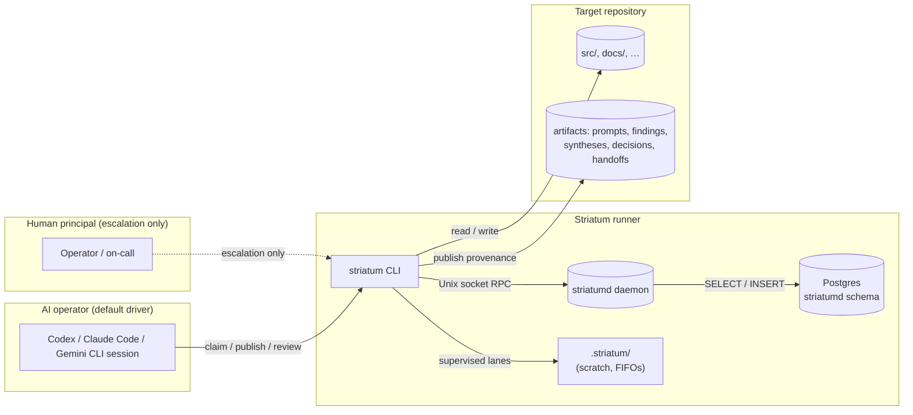
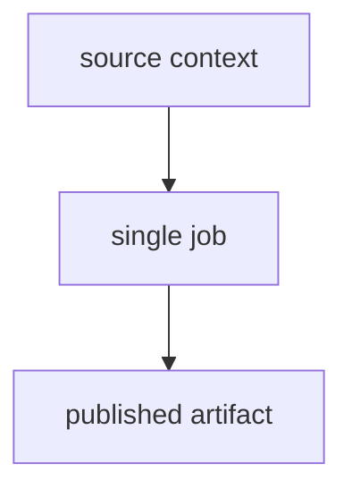
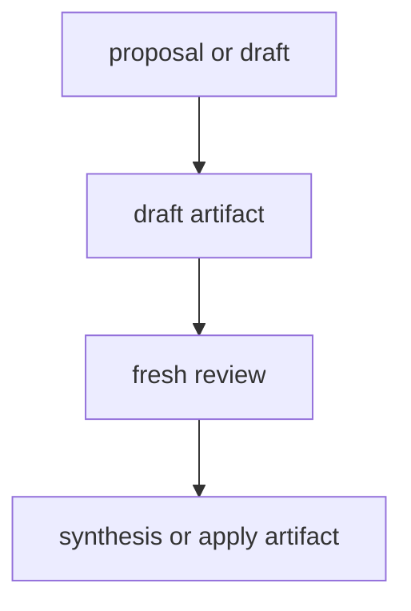
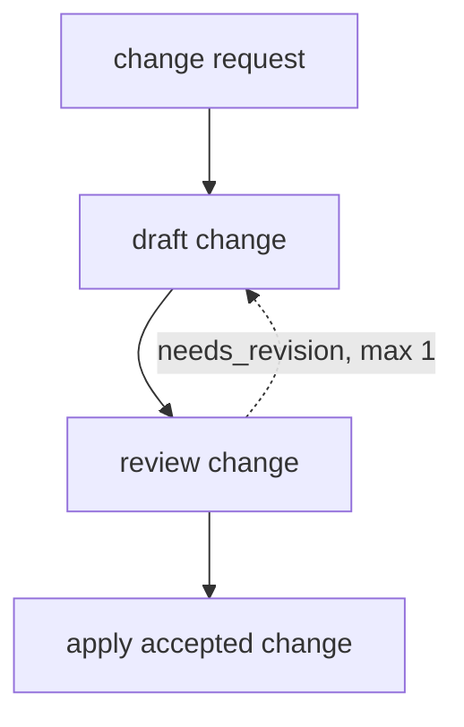
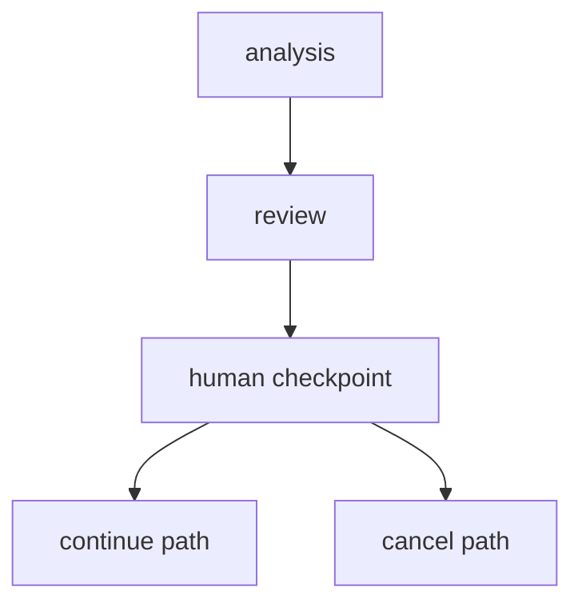
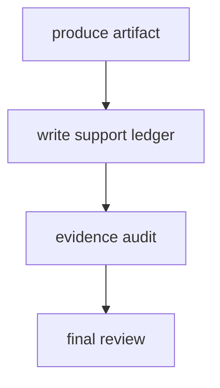
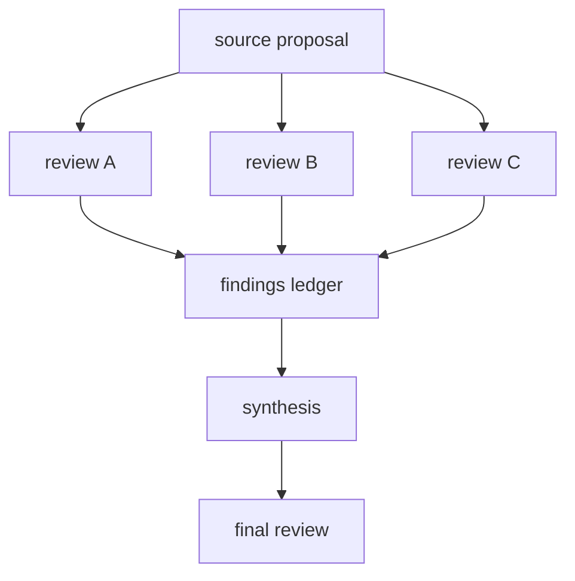

# striatum

> A local workflow runner for terminal-based AI coding agents.

AI coding agents are powerful in isolation and surprisingly fragile in combination. Without a coordinator, two agents reviewing the same draft will agree with each other whether the work is good or not. Without provenance, a crashed session leaves no reliable record of what it touched. Without explicit workflow structure, recovery means poking at files and guessing.

Striatum is the coordinator that was missing. It gives your AI agents — Codex, Claude Code, Gemini CLI, or anything that runs in a terminal — a structured multi-lane workflow with leases, verdicts, audit chains, and durable repo artifacts. No hosted service. No telemetry. No vendor SDK inside the runner.

---

## What Striatum Does

- **Coordinates multi-agent work** across parallel implement → review → repair → synthesize loops, with deterministic state tracked in a local daemon-owned Postgres database
- **Eliminates reviewer co-blindness** by making lane assignment first-class: a `codex` implementer can be reviewed by `claude` and synthesized by `gemini`; a `needs_revision` verdict is recorded, not papered over
- **Chains every event** with a SHA-256 anchor linked to its predecessor — per-repository for events, daemon-global for the RPC audit log; `daemon doctor` verifies both chains
- **Keeps providers portable** by wrapping any model whose runtime is a terminal command; core scheduling never imports a model vendor or parses terminal output
- **Produces replayable evidence** via `corpus export`: a redacted JSONL bundle with stable hashes for sharing provenance without sharing live state

The authoritative mutation surface is the daemon MCP. The same CLI verbs that the AI operator uses are available to the human principal — the distinction is not interface, it is *role*.

---

## At a Glance



The daemon owns live state. The target repository owns durable provenance.
`.striatum/` next to each target repo is operational scratch (supervised
wrapper FIFOs, pidfiles, and transient supervisor scratch). The daemon runtime
token lives under the daemon runtime directory as `client-token`.

---

## Architecture

```
┌────────────────────────────────────────────────────────────────┐
│          AI operator  ·  human principal  ·  web UI            │
│      (Codex / Claude Code / Gemini CLI / browser)              │
├────────────────────────────────────────────────────────────────┤
│         striatum CLI  ·  daemon MCP  ·  local HTTP serve       │
│             same verb surface; role distinguishes access        │
├────────────────────────────────────────────────────────────────┤
│                 Daemon RPC envelope (v1)                        │
│     capability checks · audit-chain append · method registry   │
├────────────────────────────────────────────────────────────────┤
│    Python PG handlers  ·  Go PG handlers (RFC 0039)            │
│         runs · sessions · jobs · leases · verdicts             │
│         artifacts · blockers · events · audit_log              │
├────────────────────────────────────────────────────────────────┤
│              Postgres striatumd schema (schema v6)             │
│    append-only events + artifacts  ·  hash-chained audit rows  │
│    serialized audit head  ·  per-repo event chain heads        │
└────────────────────────────────────────────────────────────────┘
                           ▲
              target repo: durable Markdown artifacts
              .striatum/: operational scratch (never live state)
```

Every state transition is a short serializable Postgres transaction that emits a structured event. Events and artifact records are append-only — `UPDATE`/`DELETE` are revoked from the daemon read-write role. The hash chain serializes concurrent appenders on the chain-head row so forks are impossible.

---

## Workflow Shapes

Striatum does not pick a default workflow. Every run starts from an explicit `workflow.json` you choose or generate. These are the canonical shapes — pick the one that matches your desired outcome.

### Minimal bounded job

One scoped task, one artifact, no review gate. Good for generating a small report, producing a migration note, or creating a first draft that will be reviewed outside Striatum.



```bash
striatum workflow init --style minimal workflows/my-task
```

### Review and synthesis

The safest first-contact shape. Exercises the core runner model without asking an agent to touch broad source areas. Good for RFC review, product proposals, TODO-to-plan conversion, and documentation review.



```bash
striatum workflow init --style review workflows/my-review
```

### Code change with bounded revision

Make a repository change and give the reviewer one explicit route to send it back. Good for small code changes, doc fixes, and focused bug fixes.



```bash
striatum workflow init --style code-change workflows/my-change
```

### Human checkpoint

Stop and wait for an owner decision before proceeding. The pause is explicit live state, not a comment in an artifact. Good for accept/reject decisions, choosing between designs, or approving a risky write scope.



Start from `examples/human-checkpoint-flow/`.

### Evidence-backed artifact

Output that makes claims auditable from curated evidence, not from a hidden transcript. Good for support-heavy technical recommendations, decisions that cite file paths or commands, and claims another reviewer must verify independently.



Start from `examples/support-ledger-flow/`.

### Multi-review synthesis

Disagreement across reviewers is the point. Parallel independent reviews feed a findings ledger or synthesis job; a final review checks the combined recommendation. Good for RFCs, architecture decisions, adversarial posture coverage, and high-risk implementation plans.



Start from `examples/rfc-ledger-cleanup/`.

---

## The Two Roles

Striatum runs with two named roles (RFC 0053):

- **AI operator** — the default driver. Claims work, publishes artifacts, advances state through `striatum` CLI verbs. Same surface that humans have; bounded by *function*, not by *interface*.
- **Human principal** — escalation only. Resolves blockers the AI judges itself stuck on (`escalation` artifacts). Routine work belongs to the operator.

The [day-zero usage guide](docs/USING_STRIATUM.md) walks new arrivals through both roles, prerequisites, first run, and the principal's escalation surface.

---

## Why Striatum

**Reviewer co-blindness.** If the same model both implements and reviews, it will accept work the operator wouldn't. Striatum makes lane assignment first-class (RFC 0018) so a `codex` implementer can be reviewed by `claude` and synthesized by `gemini`, and a verdict reaching `needs_revision` is recorded — not papered over. The dogfood ledger under `docs/dogfood/` shows where this caught real divergence between drafts.

**Audit-quality provenance.** Many workflows lose state when a session crashes, a process exits nonzero, or a serve restarts. Striatum's authoritative live state is the daemon-owned Postgres; every event carries a `previous_hash` / `row_hash` anchor (schema v6, migration 0006); every RPC request lands a row in `striatumd.audit_log` with a chain head locked `FOR UPDATE` so concurrent appenders serialize. `corpus export` produces a verifying manifest with replay-stable SHA-256s.

**Provider portability.** The runner has no model dependency. Add a lane to a workflow JSON, install a skill bundle for that provider's harness, and the same CLI verbs work. The product boundary in [`docs/SPEC.md`](docs/SPEC.md) explicitly forbids the runner from importing any vendor SDK.

---

## Quick Start

```bash
pip install striatum-orchestrator

# Check/provision the daemon's Postgres substrate.
striatum daemon doctor --apply-migrations

# Start the Go daemon in a separate terminal and keep it running.
striatum daemon start

# Adopt/register a target repo and install the operator skill bundle.
TARGET_REPO=/path/to/your/repo
striatum --repo "$TARGET_REPO" adopt --profile claude_code --json

# Drive a workflow. The operator AI does the rest.
WORKFLOW=examples/code-change-flow/workflow.json
striatum --repo "$TARGET_REPO" workflow validate "$WORKFLOW" --json
striatum --repo "$TARGET_REPO" run prepare --workflow "$WORKFLOW" --json
striatum --repo "$TARGET_REPO" run start --run-id <run_id> --json
striatum --repo "$TARGET_REPO" dashboard --run-id <run_id> --once
```

Full walkthrough: [`docs/USING_STRIATUM.md`](docs/USING_STRIATUM.md). AI-operator playbook: [`docs/HOW_TO_AGENT.md`](docs/HOW_TO_AGENT.md). Human-principal escalation guide: [`docs/HOW_TO_HUMAN.md`](docs/HOW_TO_HUMAN.md).

### Install the agent skill bundle

```bash
# Claude Code (recommended)
striatum skills install --profile claude_code

# Codex
striatum skills install --profile codex

# Gemini CLI
striatum skills install --profile gemini

# All at once
striatum skills install --profile all
```

The skill bundle teaches a Striatum-aware agent how to drive the runner without reading the source repo. Generated files are version-stamped; `striatum doctor` flags outdated bundles and emits the exact `skills install` invocation to fix them.

### Use the local web UI

```bash
striatum --repo "$TARGET_REPO" serve --web --allow-mutations
```

Server-rendered Jinja2 UI with a live SVG dependency graph, state-colored job nodes, artifact browsing, verdict recording, and recovery actions. Loopback-only; non-loopback bind is refused at startup.

---

## Project Status

| Area | Status |
|------|--------|
| Version | v1.55.0 (see [CHANGELOG.md](CHANGELOG.md)) |
| Platforms | Linux + macOS · Python 3.11+ · Postgres 14+ |
| PyPI | `striatum-orchestrator` |
| License | Apache-2.0 |
| CI | 1254 passed / 7 skipped / 0 failures on `main` as of v1.55.0 |
| Daemon substrate | Postgres-native (RFC 0048 complete through all three phases) |
| Schema | v6 — dedicated `previous_hash`/`row_hash` columns, serialized chain-head writes |
| Go daemon | Phase 1 landed (RFC 0039): read-only method registry + PG/audit layer; mutating verbs and distribution artifacts are Phase 2 |
| Active RFCs | RFC 0050 ergonomics polish; RFC 0051 auto-finalize; RFC 0039 Phase 2 (Go core CLI) |
| Corpus export / augmentation | Corpus Contract V2 core landed; optional reference-only augmentation stays local and Striatum runs with external memory absent |

---

## Install from Source

```bash
git clone https://github.com/halbritt/striatum.git
cd striatum
make install
.venv/bin/striatum --help
```

Run tests:

```bash
make lint typecheck test
```

For development without installing the console script:

```bash
PYTHONPATH=src python3 -m striatum.cli --help
```

---

## Documentation

| File | When to read |
|---|---|
| [`docs/USING_STRIATUM.md`](docs/USING_STRIATUM.md) | The day-zero usage guide — operator + principal in one pass |
| [`docs/HOW_TO_HUMAN.md`](docs/HOW_TO_HUMAN.md) | Human-principal escalation playbook; retains manual operator reference for debugging and demos |
| [`docs/HOW_TO_AGENT.md`](docs/HOW_TO_AGENT.md) | Long-form companion to the RFC 0015 agent skill bundle |
| [`docs/POSTGRES_TRANSITION.md`](docs/POSTGRES_TRANSITION.md) | Operator runbook for the D094 / RFC 0043 PostgreSQL cutover, retired SQLite handling, and repo registration |
| [`docs/WORKFLOW_TYPES.md`](docs/WORKFLOW_TYPES.md) | Workflow shapes and lane sets; starters, examples, defaults |
| [`docs/WRITING_WORKFLOWS.md`](docs/WRITING_WORKFLOWS.md) | How to author your own `workflow.json` |
| [`docs/CLI_REFERENCE.md`](docs/CLI_REFERENCE.md) | Flat list of every CLI verb and stable exit codes |
| [`docs/SPEC.md`](docs/SPEC.md) | The implementation contract; source of truth when this page disagrees with the runner |
| [`docs/CONSUMER_REPO_LAYOUT.md`](docs/CONSUMER_REPO_LAYOUT.md) | Recommended target-repo layout (RFC 0056) |
| [`docs/ROADMAP.md`](docs/ROADMAP.md) | Operator kickoff doc: active runway, queue, blocked items |
| [`docs/INDEX.md`](docs/INDEX.md) | Every doc in `docs/` with a one-line summary |
| [`docs/rfcs/README.md`](docs/rfcs/README.md) | Accepted and proposed RFCs (0001 → current) |
