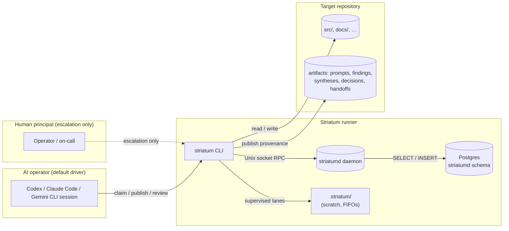

# striatum

**A local workflow runner for terminal-based AI coding agents.** Coordinates Codex / Claude Code / Gemini CLI sessions across draft → review → repair → synthesize loops, with audit-chain provenance for every decision and no hosted coordinator.

- **Local-first.** All workflow state lives in a daemon-owned PostgreSQL you control. No outbound calls, no transcript capture, no telemetry. The runner itself never imports a model vendor.
- **Multi-lane reviews.** Run N implementers in parallel and route their outputs through deterministic review cycles. The vocabulary in [`docs/UBIQUITOUS_LANGUAGE.md`](docs/UBIQUITOUS_LANGUAGE.md) is the model; daemon RPC methods are the state-mutation boundary, with CLI/MCP/web surfaces acting as clients.
- **Audit chain.** Every event and audit row carries a SHA-256 anchor chained to its predecessor. The chain is per-repository for events, daemon-global for the RPC audit log; `daemon doctor` verifies both.
- **Provider portability.** Wrap any model whose runtime is a command. Add a lane to a workflow; the rest of the system doesn't change.
- **Replayable evidence.** `corpus export` produces a redacted JSONL bundle with stable hashes — share what happened without sharing live state.

## At a glance



The daemon owns live state. The target repository owns durable provenance.
`.striatum/` next to each target repo is operational scratch (supervised
wrapper FIFOs, pidfiles, and transient supervisor scratch). The daemon runtime
token lives under the daemon runtime directory as `client-token`.

## The two roles

Striatum runs with two named roles (RFC 0053):

- **AI operator** — the default driver. Claims work, publishes artifacts, advances state through `striatum` CLI verbs. Same surface that humans have; bounded by *function*, not by *interface*.
- **Human principal** — escalation only. Resolves blockers the AI judges itself stuck on (`escalation` artifacts), routine work belongs to the operator.

The [day-zero usage guide](docs/USING_STRIATUM.md) walks new arrivals through both roles, prerequisites, first run, and the principal's escalation surface.

## Quick start

```bash
pip install striatum-orchestrator

# Check/provision the daemon's Postgres substrate.
striatum daemon doctor --apply-migrations

# Start the daemon in a separate terminal and keep it running.
striatum daemon start

# Adopt/register a target repo and install the operator skill bundle.
TARGET_REPO=/path/to/your/repo
striatum --repo "$TARGET_REPO" adopt --profile claude_code --json

# Drive a workflow. The operator AI does the rest.
WORKFLOW=examples/code-change-flow/workflow.json
striatum --repo "$TARGET_REPO" workflow validate "$WORKFLOW" --json
striatum --repo "$TARGET_REPO" run prepare --workflow "$WORKFLOW" --json
striatum --repo "$TARGET_REPO" run start --run-id <run_id> --json
striatum --repo "$TARGET_REPO" dashboard --run-id <run_id> --once
```

Full walkthrough: [`docs/USING_STRIATUM.md`](docs/USING_STRIATUM.md). AI-operator playbook: [`docs/HOW_TO_AGENT.md`](docs/HOW_TO_AGENT.md). Human-principal escalation playbook: [`docs/HOW_TO_HUMAN.md`](docs/HOW_TO_HUMAN.md).

## Why striatum

Three problems the runner is built around:

**Reviewer co-blindness.** If the same model both implements and reviews, it will accept work the operator wouldn't. Striatum makes the lane assignment first-class (RFC 0018) so a `codex` implementer can be reviewed by `claude` and synthesized by `gemini`, and a verdict reaching `needs_revision` is recorded — not papered over. The dogfood ledger under `docs/dogfood/` shows where this caught real divergence between drafts.

**Audit-quality provenance.** Many workflows lose state when a session crashes, a process exits nonzero, or a serve restarts. Striatum's authoritative live state is the daemon-owned Postgres; every event carries a `previous_hash` / `row_hash` anchor (schema v6, migration 0006); every RPC request lands a row in `striatumd.audit_log` with a chain head locked `FOR UPDATE` so concurrent appenders serialize. `corpus export` produces a verifying manifest with replay-stable SHA-256s.

**Provider portability.** The runner has no model dependency. Add a lane to a workflow JSON, install a skill bundle for that provider's harness, and the same CLI verbs work. The product boundary in [`docs/SPEC.md`](docs/SPEC.md) explicitly forbids the runner from importing any vendor SDK.

## Project status

- **Version**: see [`CHANGELOG.md`](CHANGELOG.md); the latest tag is the source of truth.
- **Platforms**: Linux + macOS. Python 3.11+. Postgres 14+ (system install).
- **PyPI**: `striatum-orchestrator` (the bare `striatum` package on PyPI is unrelated). Python module name is `striatum`.
- **License**: Apache-2.0.
- **RFCs**: [`docs/rfcs/README.md`](docs/rfcs/README.md). RFC 0048 (substrate port to PG-native daemon handlers) completed in v1.55.0. Active work is tracked in [`docs/TODO.md`](docs/TODO.md) and [`docs/ROADMAP.md`](docs/ROADMAP.md).
- **Contributions**: follow [`AGENTS.md`](AGENTS.md). Make changes through the dogfood workflow when the change is RFC-class; cowboy commits are fine for small bugs and docs.

## Install from source

```bash
git clone https://github.com/halbritt/striatum.git
cd striatum
make install
.venv/bin/striatum --help
```

Run the tests:

```bash
make lint typecheck test
```

For development without installing the console script:

```bash
PYTHONPATH=src python3 -m striatum.cli --help
```

## Documentation

| File | When to read |
|---|---|
| [`docs/USING_STRIATUM.md`](docs/USING_STRIATUM.md) | The day-zero usage guide — operator + principal in one pass. |
| [`docs/HOW_TO_HUMAN.md`](docs/HOW_TO_HUMAN.md) | Human-principal escalation playbook; retains manual operator reference for debugging and demos. |
| [`docs/HOW_TO_AGENT.md`](docs/HOW_TO_AGENT.md) | Long-form companion to the RFC 0015 agent skill bundle. |
| [`docs/POSTGRES_TRANSITION.md`](docs/POSTGRES_TRANSITION.md) | Operator runbook for the D094 / RFC 0043 PostgreSQL cutover and per-repo migration. |
| [`docs/WORKFLOW_TYPES.md`](docs/WORKFLOW_TYPES.md) | Workflow shapes and lane sets; starters, examples, defaults. |
| [`docs/WRITING_WORKFLOWS.md`](docs/WRITING_WORKFLOWS.md) | How to author your own `workflow.json`. |
| [`docs/CLI_REFERENCE.md`](docs/CLI_REFERENCE.md) | Flat list of every CLI verb and stable exit codes. |
| [`docs/SPEC.md`](docs/SPEC.md) | The implementation contract; the source of truth when this page disagrees with the runner. |
| [`docs/CONSUMER_REPO_LAYOUT.md`](docs/CONSUMER_REPO_LAYOUT.md) | Recommended target-repo layout (RFC 0056). |
| [`docs/INDEX.md`](docs/INDEX.md) | Every doc in `docs/` with a one-line summary. |
| [`docs/rfcs/README.md`](docs/rfcs/README.md) | Accepted and proposed RFCs (0001 → current). |
