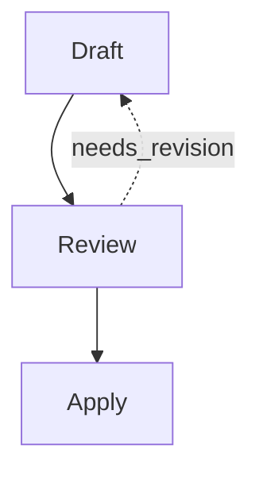
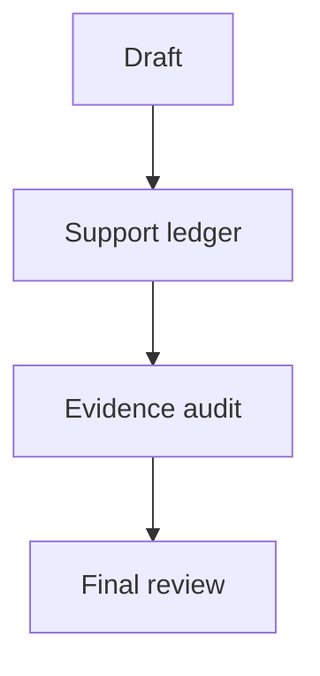
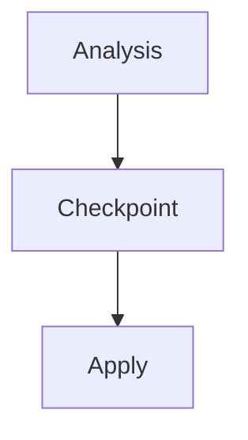
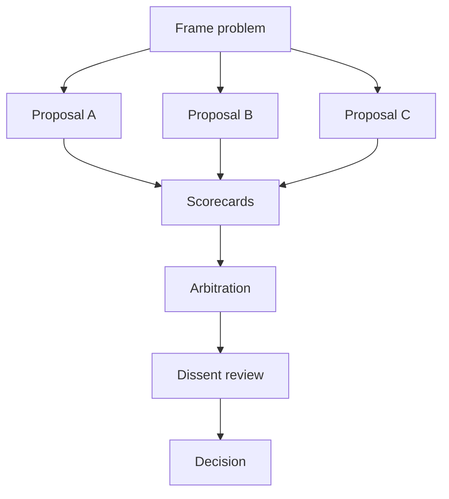
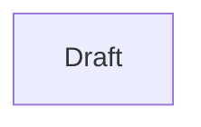
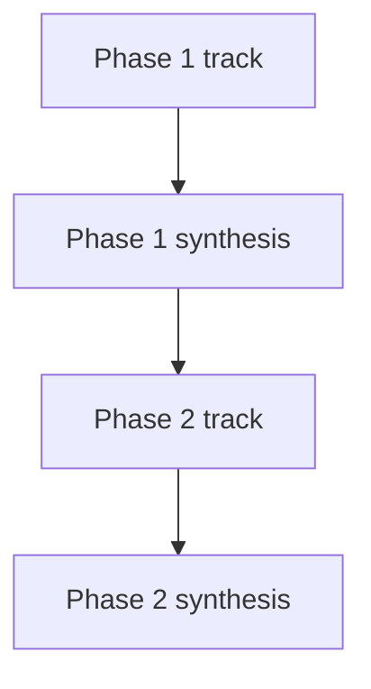
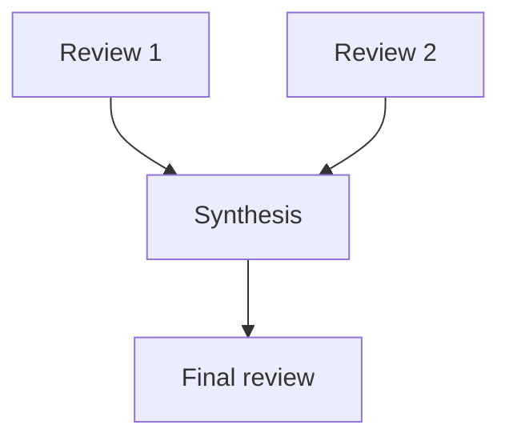
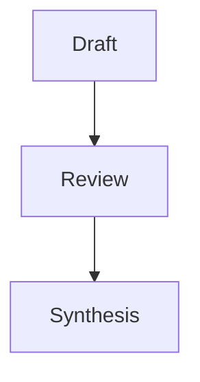

# Workflow Template Catalog

Generated from the bundled Striatum workflow template catalog.

## Workflow Shapes

### Code change with bounded revision (`code_change`)

Draft, review, revise at most once if needed, then apply.

- Recommended for: small code or docs edits that need an explicit review gate
- Default lane sets: `author_reviewer`, `single_agent`
- Required options: `workflow_id`, `artifact_root`

### Custom safe block plan (`custom`)

Compose a workflow from known block kinds without raw workflow JSON.

- Recommended for: advanced operators who need a graph not covered by a built-in shape
- Default lane sets: `custom`
- Required options: `plan`, `workflow_id`, `artifact_root`

No fixed graph preview.

### Evidence-backed artifact (`evidence_backed`)

Produce claims with a support ledger and audit review.

- Recommended for: artifacts whose claims need explicit evidence checking
- Default lane sets: `author_reviewer`
- Required options: `workflow_id`, `artifact_root`

### Human checkpoint (`human_checkpoint`)

Require owner judgment before downstream work proceeds.

- Recommended for: runs that need an explicit operator decision gate
- Default lane sets: `author_reviewer`, `single_agent`
- Required options: `workflow_id`, `artifact_root`

### Implementation panel (`implementation_panel`)

Compare several implementation approaches with explicit scorecards, arbitration, dissent, and a final decision.

- Recommended for: contested implementation choices; architecture trade-off resolution; high-risk design forks
- Default lane sets: `multi_review`, `author_reviewer`
- Required options: `workflow_id`, `artifact_root`

### Minimal bounded job (`minimal`)

One bounded job for a small report or starter artifact.

- Recommended for: small reports; narrow inspections; first drafts
- Default lane sets: `local`, `single_agent`
- Required options: `workflow_id`, `artifact_root`

### Multi-phase workflow (`multi_phase`)

Run phase-scoped parallel tracks behind explicit synthesis gates.

- Recommended for: large work split into ordered design, build, review, or release phases
- Default lane sets: `author_reviewer`, `multi_review`, `single_agent`
- Required options: `workflow_id`, `artifact_root`, `phases`

### Multi-review synthesis (`multi_review_synthesis`)

Collect several independent reviews before a final recommendation.

- Recommended for: productive disagreement; RFC or proposal review
- Default lane sets: `multi_review`
- Required options: `workflow_id`, `artifact_root`

### Review and synthesis (`review`)

Draft, fresh review, then final synthesis.

- Recommended for: proposal review; bug triage; documentation review
- Default lane sets: `author_reviewer`, `single_agent`, `local`
- Required options: `workflow_id`, `artifact_root`

## Lane Sets

### Separate author and reviewer (`author_reviewer`)

Authoring jobs and review jobs bind to separate lanes.

- Recommended for: independent review for a code or docs change
- Required options: `lanes.author.command`, `lanes.reviewer.command`

### Custom lane bindings (`custom`)

Advanced lane topology with every binding declared.

- Recommended for: custom plans with explicit job-to-lane bindings
- Required options: `lanes`, `plan.job_lane_bindings`

### Local fixture lane (`local`)

Fixture/operator-by-hand starter lane that validates without a real model command.

- Recommended for: tests; operator-by-hand runs; starter scaffolds

### Multiple reviewers (`multi_review`)

One author lane plus several reviewer lanes.

- Recommended for: productive disagreement through multiple review postures
- Required options: `lanes.author.command`

### Single agent (`single_agent`)

One real agent session handles the whole workflow.

- Recommended for: small low-risk work; early adoption
- Required options: `lanes.agent.command`

## Role Packs

### Implementation panel roles (`implementation_panel_roles`)

Independent proposal authors, a scorekeeper, an arbitrator, and a dissent reviewer for explicit trade-off resolution.

- Recommended for: implementation_panel; architecture_tournament
- Default shapes: `implementation_panel`
- Roles: `problem_framer`, `proposer_a`, `proposer_b`, `proposer_c`, `scorekeeper`, `tradeoff_ledger`, `arbitrator`, `dissent_reviewer`, `principal_decider`

### Incident response roles (`incident_response`)

Reproduction, root-cause, fix-planning, verification, and retrospective viewpoints for incident closure.

- Recommended for: incident follow-up; workflow failure analysis
- Default shapes: `review`, `evidence_backed`
- Roles: `reproducer`, `root_cause_analyst`, `fix_planner`, `verifier`, `retrospective_author`

### Release readiness roles (`release_readiness`)

Release, documentation, migration, smoke-test, and rollback viewpoints for shipping decisions.

- Recommended for: release readiness reviews; migration releases
- Default shapes: `review`, `multi_review_synthesis`
- Roles: `release_manager`, `docs_reviewer`, `migration_reviewer`, `smoke_verifier`, `rollback_reviewer`

## Adversary Packs

### Maintainer cost pressure (`maintainer_cost`)

Challenge approaches on long-term ownership, migration burden, and support cost.

- Recommended for: architecture choices; large refactors
- Default shapes: `implementation_panel`, `code_change`
- Postures: `maintainability`, `migration_risk`, `reversibility`

### Operator ergonomics pressure (`operator_ergonomics`)

Challenge approaches on setup clarity, repeated-use friction, recovery behavior, and local-first operation.

- Recommended for: operator tools; workflow catalog entries
- Default shapes: `implementation_panel`, `review`
- Postures: `operator_experience`, `recovery`, `documentation`

### Security and privacy pressure (`security_privacy`)

Challenge approaches on capability scope, data minimization, secret handling, and persistence boundaries.

- Recommended for: MCP surfaces; artifact export; daemon methods
- Default shapes: `review`, `evidence_backed`
- Postures: `security`, `privacy`, `capability_scope`
