# Workflow Types

Status: guide
Date: 2026-05-11

This guide answers the operator question that the JSON schema does
not answer by itself: **which kind of workflow should I set up, and
which lanes should run it?**

`workflow type` is a documentation and product-planning category,
not a field in `workflow.json`. The executable contract is still the
workflow file validated by `striatum workflow validate`; this page is
the selection map you read before authoring or choosing that file.

## Defaults

striatum does **not** choose an automatic default workflow for a
target repository. Every run is prepared from an explicit
`workflow.json` path:

```bash
striatum --repo "$TARGET_REPO" run prepare --workflow path/to/workflow.json
```

There are starter surfaces, but they are not the same thing as a
runtime default:

| Surface | Current behavior |
|---|---|
| `striatum workflow init` | Scaffolds a new workflow tree. If `--style` is omitted, the scaffold style is `review`. |
| `--style minimal` | One bounded job that publishes one artifact. |
| `--style review` | Draft -> fresh review -> synthesis/apply. This is the recommended first-contact style. |
| `--style code-change` | Draft -> review -> apply, with one bounded `needs_revision` cycle back to draft. |
| `examples/` | Runnable fixtures and reference workflows. They are useful starting points, but the runner never auto-selects them. |
| Historical fixtures | Incubation provenance. Read them for context, not as current default workflows. |
| `striatum workflow templates` | Lists, shows, and renders the bundled local catalog of workflow shapes and lane sets. |
| `striatum workflow generate` | Generates a complete workflow tree from a shape, lane set, artifact root, and options; validates immediately; never runs the workflow. |
| Web UI | The workflow browser and editor can list, preview, edit, and run existing workflow files; a template chooser UI is still future work, but service endpoints expose catalog and generation previews. |

The scaffolded workflows use a single `local` process lane as a
placeholder. That lane is valid JSON and useful for fixture tests, but
it is not a real model choice. For a real run, choose the lane set
deliberately and bind jobs to those lanes.

## Selection Heuristic

Start from the run outcome, not from the project type. A Python repo,
a docs repo, and a personal notes repo can all use the same workflow
type if the desired outcome is the same.

For a new workflow, prefer the generator before hand-editing JSON:

```bash
striatum workflow templates list --kind shape
striatum workflow generate striatum/workflows/my-change \
  --shape code_change \
  --lane-set local \
  --artifact-root striatum/my-change \
  --dry-run --json
```

Drop `--dry-run` once the preview is right. `run prepare` still needs
the generated `workflow.json` path explicitly.

| Desired outcome | Use this type | Closest current starter |
|---|---|---|
| Do one small, bounded task and publish one artifact | Minimal bounded job | `workflow init --style minimal` |
| Review a proposal, bug report, RFC, TODO, or draft before acting | Review and synthesis | `workflow init --style review` |
| Make a code or docs change with a review gate | Code change with bounded revision | `workflow init --style code-change` |
| Require an owner decision before proceeding | Human checkpoint | `examples/human-checkpoint-flow/` |
| Produce an artifact whose claims need explicit evidence | Evidence-backed artifact | `examples/support-ledger-flow/` |
| Collect several independent reviews before a final recommendation | Multi-review synthesis | `examples/rfc-ledger-cleanup/` |
| Audit code, docs, RFC status, and operator adoption risk together | Three-lane code and docs audit | RFC 0076 operator workflow |

## Lane Selection Heuristic

After choosing the graph shape, choose the lane set. A lane is a named
execution configuration: adapter, command, display model, capabilities,
constraints, optional harness profile, and optional worktree isolation.
Jobs bind to lanes with `lane_id`; if a job omits `lane_id`, the work
message is not lane-constrained and any matching role session may claim
it. Prefer explicit `lane_id` values for repeatable runs.

| Desired lane behavior | Use this lane shape | Current starting point |
|---|---|---|
| Fast local fixture or operator-by-hand run | Single `local` process lane | `workflow init --style ...` |
| One model does authoring and review | Single agent lane with `write` and `review` capabilities | `examples/code-change-flow/` |
| Author and reviewer should be separate model sessions | Separate author/reviewer lanes or fresh reviewer jobs | Adapt `examples/docs-review-flow/` |
| You want productive disagreement | Multiple reviewer lanes, often different model families | `examples/rfc-ledger-cleanup/` |
| You need a long-lived agent process | `process` lane plus `striatum supervise` and a compatible wrapper | `examples/harness-profiles/` |
| You need isolated repo writes | Lane with `worktree_isolation: "per_job"` | See `docs/WRITING_WORKFLOWS.md` |
| You need offline/local-only constraints | Lane `constraints` plus `required_enforcement` where needed | `examples/adapter-unavailable-flow/` |
| You want tool-family guidance surfaced in packets | Lane with `harness_profile_id` | `examples/harness-profiles/` |

The smallest useful real-world choice is usually one author lane and
one fresh reviewer lane. The strongest review choice is multiple fresh
reviewer lanes with distinct model families or review postures. The
most operationally convenient choice is often a single supervised lane,
but only when the lane command can read newline-delimited work packets
from stdin and keep enough state to be useful.

### Common Lane Sets

**Single-lane starter**

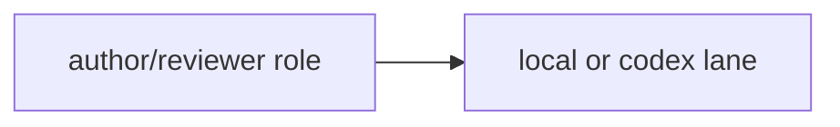

Use this for early adoption, small low-risk work, or when one
operator-by-hand session is driving all roles.

**Author plus independent reviewer**

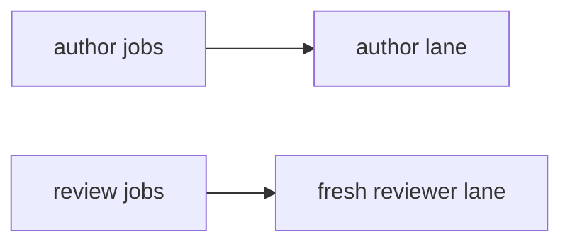

Use this when review independence matters. Pair it with
`fresh_session_required: true` and reviewer policy fields on review
jobs.

**Multi-review lane fan-out**

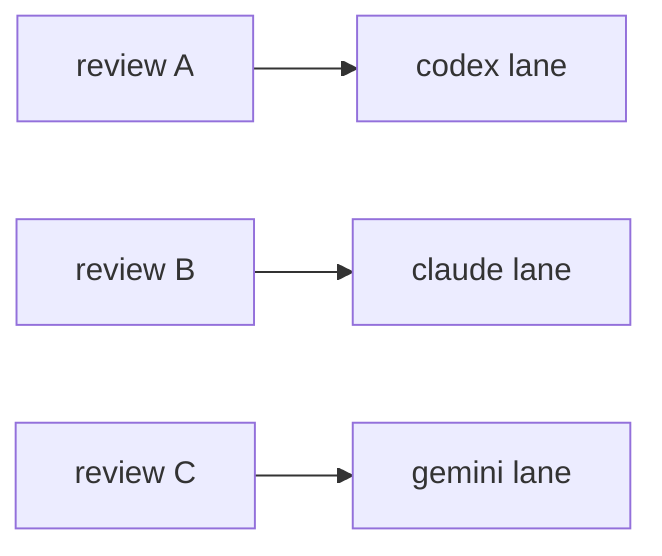

Use this when disagreement is part of the value. The workflow graph
should make the convergence point explicit with a findings ledger,
synthesis, or final review job.

**Supervised lane**

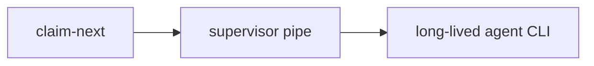

Use this when the agent CLI benefits from persistent context across
work packets. Avoid pointing a supervised lane at a command that reads
one prompt and exits; use a wrapper when the tool needs one.

### Lane Configuration Checklist

For each lane, decide:

- **adapter**: today this is usually `process`.
- **command**: the local command Striatum launches for process-adapter
  runs or supervision.
- **display_model**: the human-readable model name recorded in
  artifacts and evidence.
- **capabilities**: what kinds of jobs the lane is intended to claim,
  such as `write`, `review`, or `synthesis`.
- **constraints**: network, transcript, or repo-scope requests.
- **required_enforcement**: whether validation should reject a lane if
  the adapter cannot enforce a declared constraint strongly enough.
- **harness_profile_id**: optional tool-family metadata exposed in work
  packets.
- **worktree_isolation**: use `per_job` for repo-write lanes that need
  isolated worktrees.

Minimal lane example:

```json
{
  "agent": {
    "adapter": "process",
    "display_model": "Your Agent Model",
    "command": ["your-agent-cli", "run-from-stdin"],
    "capabilities": ["write", "review", "synthesis"],
    "constraints": {
      "transcripts": "off",
      "repo_scope": "local_only"
    }
  }
}
```

Lane names are local workflow vocabulary. A lane named `codex` is only
Codex because its command/profile says so; core scheduling does not
infer provider behavior from the lane id. Replace placeholder command
arrays with the actual invocation shape your agent CLI expects.

## Minimal Bounded Job

Use this when you want Striatum's lease, artifact, and audit discipline
around one well-scoped task, without a review gate.

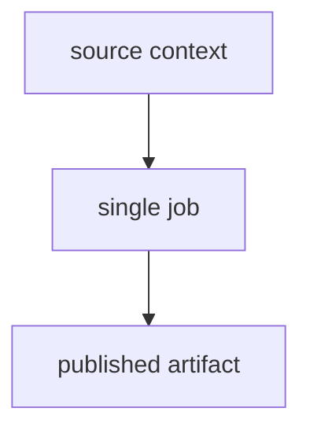

Good fits:

- generate a small report
- produce a migration note
- inspect a narrow source area and publish findings
- create a first draft that will be reviewed outside Striatum

Start with:

```bash
striatum workflow init --style minimal striatum/workflows/my-task
```

## Review And Synthesis

Use this when the main value is independent review before the final
recommendation or summary. This is the safest first-contact shape
because it exercises the core runner model without asking an agent to
touch broad source areas.

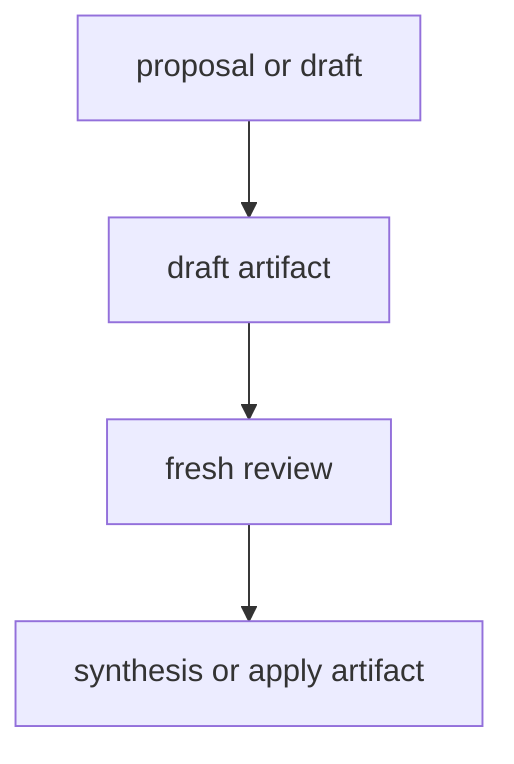

Good fits:

- RFC review
- product proposal review
- TODO-to-plan conversion
- documentation review
- bug triage before implementation

Start with:

```bash
striatum workflow init --style review striatum/workflows/my-review
```

## Code Change With Bounded Revision

Use this when the workflow should make a repository change and give
the reviewer one explicit route to send it back for revision.

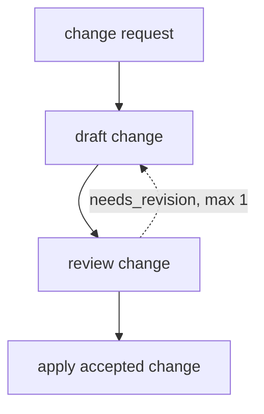

Good fits:

- small code change
- docs change with review
- focused bug fix
- applying accepted review feedback

Start with:

```bash
striatum workflow init --style code-change striatum/workflows/my-change
```

## Human Checkpoint

Use this when the runner must stop and wait for an owner decision
before proceeding. The checkpoint is explicit live state, not a
comment in an artifact.

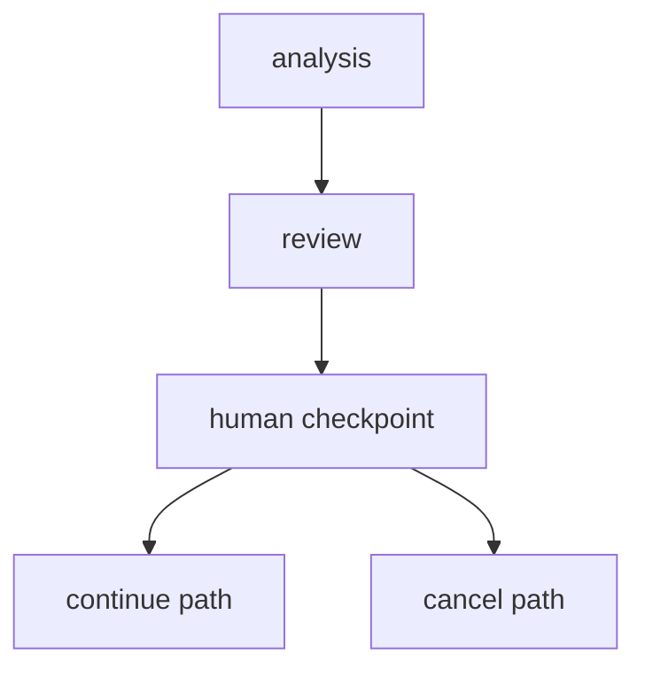

Good fits:

- accept/reject a recommendation before implementation
- choose between competing designs
- approve a risky write scope
- stop a run that surfaced a policy concern

Start from `examples/human-checkpoint-flow/` until there is a
first-class scaffold style for this type.

## Evidence-Backed Artifact

Use this when the output makes claims that should be auditable from
curated evidence, not from an agent's hidden transcript.

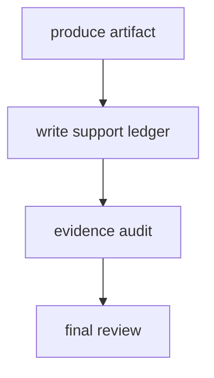

Good fits:

- support-heavy technical recommendations
- decisions that cite file paths, commands, or reports
- claims that another reviewer must verify without replaying a
  model session

Start from `examples/support-ledger-flow/`.

## Multi-Review Synthesis

Use this when disagreement across reviewers is the point. Independent
review artifacts feed a ledger or synthesis job, then a final review
checks the combined recommendation.

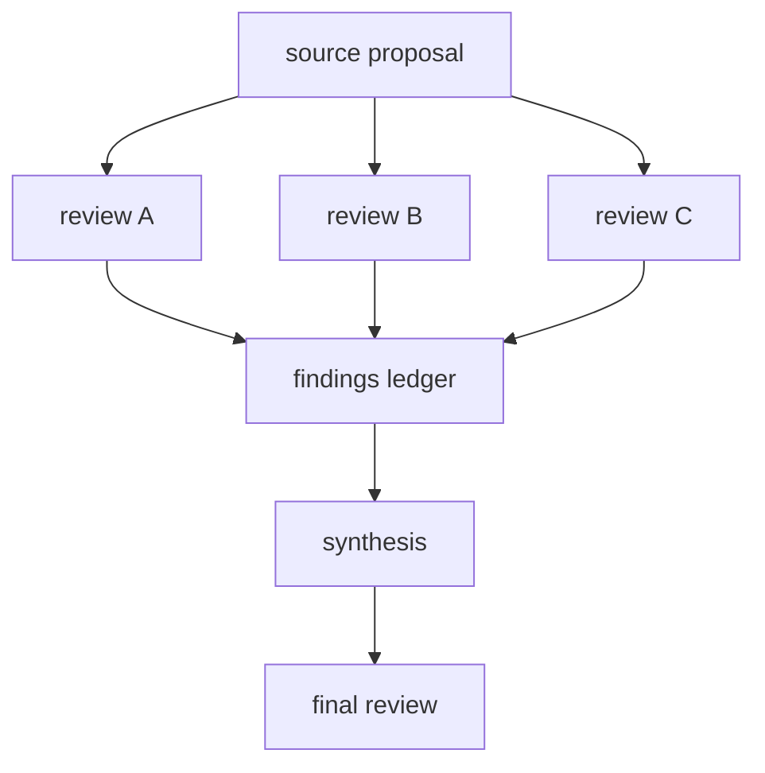

Good fits:

- RFC acceptance
- architecture decisions
- adversarial review across postures
- high-risk implementation plans

Start from `examples/rfc-ledger-cleanup/` for the current generic
shape. Treat `examples/rfc-0014-operational-artifact-home/` and old
P00x prompt material as historical reference unless a task explicitly
asks for that provenance.

## Three-Lane Code And Documentation Audit

Use this when the question is not "is this patch good?", but "where has
the product, source, and documentation drifted?"

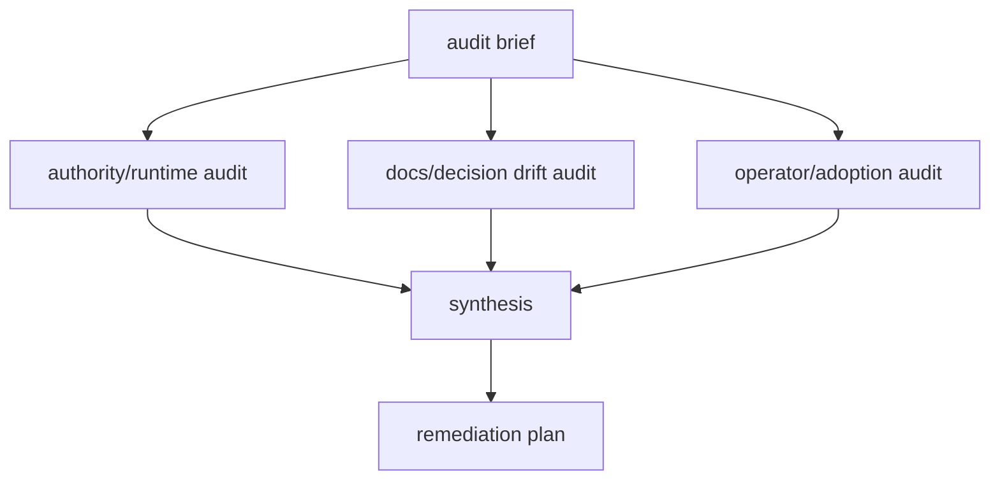

Good fits:

- periodic full-repo audit
- checking half-implemented or superseded RFCs
- release-candidate source/docs consistency review
- validating day-zero operator adoption
- finding gaps between daemon behavior, docs, examples, and TODOs

Start from
`docs/operator/workflows/rfc-0076-code-doc-audit/workflow.json` or
adapt the accepted shape described in RFC 0076 until a generator/catalog
entry lands. The first runnable operator workflow completed on
2026-05-22 with one operator-recovered Claude lane and produced
follow-up work in
`docs/operator/artifacts/rfc-0076-code-doc-audit/REMEDIATION_PLAN.md`.

The audit should produce evidence-backed findings and a remediation
plan, not silently fix every issue it discovers. Tmux panes or terminal
output can help an operator observe a stuck lane, but they are not
workflow state or audit evidence.

## Current UI Path

The local web UI already covers discovery and editing for existing
workflow files:

```bash
striatum --repo "$TARGET_REPO" serve --web --allow-mutations
```

Then open `/workflows/` to browse detected `workflow.json` files,
inspect validation status, preview the graph, edit a workflow, and
run it. The missing layer is a product catalog that starts from
"what kind of workflow do you want?" rather than "which JSON file
already exists?"

## Roadmap To A Chooser

[`RFC 0034`](rfcs/0034-workflow-generator-and-template-catalog.md)
proposes turning this guide's workflow types and lane sets into a
first-class generator, CLI catalog, and UI chooser.

The roadmap from today's docs and examples to a workflow-selection UI
is:

1. **Document the types.** This guide is the first pass: name the
   workflow families, show the graph shapes, and say which starter is
   closest.
2. **Promote starters into templates.** Define a small blessed set of
   template IDs (`minimal`, `review`, `code-change`, `human-checkpoint`,
   `support-ledger`, `multi-review-synthesis`) instead of asking users
   to infer intent from example directory names.
3. **Add template metadata.** Each template should declare display
   name, summary, recommended use cases, required roles, recommended
   lane sets, artifact layout, and graph preview source. The CLI, docs,
   and UI should all read the same metadata.
4. **Expose CLI catalog verbs.** Add commands such as
   `striatum workflow templates list`, `show`, and
   `init --template <id>` while keeping the existing `--style` flags as
   compatibility sugar.
5. **Add a UI chooser.** Let the operator pick a workflow type, target
   path, output root, lane/profile choices, and optional review
   postures; then open the generated workflow in the existing visual
   builder for validation and run-now.
6. **Add assisted scaffolding later.** Chat-assisted workflow creation
   should write through the same template/catalog surface and the same
   mutation gate. No hosted marketplace or external import is implied by
   this roadmap.

## When Adding A New Type

Add a new type only when it changes operator choice. A different file
layout or prompt wording is usually a template variant, not a new type.

A new workflow type should update:

- this guide, with a graph and starter recommendation
- `docs/WRITING_WORKFLOWS.md`, if the authoring advice changes
- `docs/UBIQUITOUS_LANGUAGE.md`, if it introduces a new term
- `docs/TODO.md` or an RFC, if it implies new product surface
- `examples/`, if there is a runnable generic fixture
