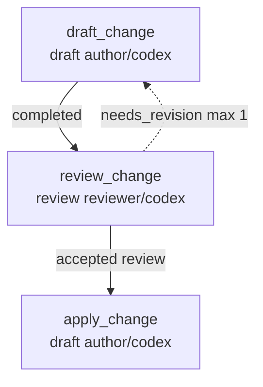

# Writing Workflows

This guide is for authoring a `workflow.json` from scratch (or
from a starter scaffold) and validating it against the runner.
For the operator-side commands that consume a workflow, see
[HOW_TO_HUMAN.md](HOW_TO_HUMAN.md).

## Start from an example

Start from `examples/rfc-ledger-cleanup/workflow.json`. For
smaller fixtures, see `examples/docs-review-flow/`,
`examples/code-change-flow/`,
`examples/failed-review-revision-cycle/`,
`examples/human-checkpoint-flow/`, and
`examples/adapter-unavailable-flow/`.

Or scaffold a new tree:

```bash
striatum workflow init --style review path/to/new-flow
```

`--style` accepts `minimal`, `review` (default), or `code-change`.
The generated tree includes `workflow.json` plus `roles/` and
`prompts/` stubs and validates cleanly. The command refuses to
overwrite an existing path.

## Required top-level fields

`schema_version`, `workflow_id`, `workflow_version`, `name`,
`branch`, `coordinator`, `lanes`, `roles`, `context_docs`,
`parallelism`, `jobs`, `edges`, `cycles`.

`schema_version` is `striatum.workflow.v1` for V1 workflows.

## Common job fields

`id`, `type`, `title`, `role_id`, optional `lane_id`, `objective`,
`task_prompt`, `inputs`, `write_scope` (`allowed_paths`,
`forbidden_paths`), `expected_artifacts` (`logical_name`, `kind`,
`path`, `required`), `fresh_session_required`, and
`parallel_group`.

## Adapter constraints

Lane configs may declare adapter constraints:

```json
{
  "constraints": {
    "network": "forbidden",
    "transcripts": "off",
    "repo_scope": "local_only"
  },
  "required_enforcement": {
    "network": "advisory_strict",
    "transcripts": "enforced"
  }
}
```

V1 records the requested constraint, the required enforcement
level, the adapter's actual enforcement (`enforced`,
`advisory_strict`, `advisory`, or `unsupported`), and satisfaction
status in work packets. Validation rejects a lane when
`required_enforcement` asks for a level the adapter cannot
provide. The local process adapter enforces transcript-off,
scrubs proxy env vars when network is forbidden, and sets
`STRIATUM_NETWORK_POLICY` and `STRIATUM_REPO_SCOPE` sentinels so
cooperating agents can honor the policy.

## Shape a custom run scaffold

A striatum run starts from a concrete design proposal, not from a
project type. The proposal can be an RFC, TODO, bug report,
feature request, review finding, support note, or any other local
artifact that describes the desired change or decision. Keep that
source artifact in the target repository and reference it from
`context_docs` or the relevant job `inputs`.

Before editing `workflow.json`, choose the run outcome:

- **review only**: independent reviewers inspect the source
  proposal, publish findings, and a synthesis job produces the
  durable recommendation.
- **produce a spec**: reviewers or researchers feed a
  spec-authoring job, then a review gate checks the generated
  spec before the run ends.
- **produce a spec and implement**: the spec path continues into
  implementation, build or test verification, and final review.
- **repair implementation**: a bug report, failing review, or
  smoke-test finding feeds an implementation job and a focused
  verification job.
- **human checkpoint**: the runner records a required owner
  decision before later jobs become claimable.

Use `workflow init --style review` for proposal review, RFC
cleanup, bug triage, feature request analysis, and TODO
conversion. Use `--style code-change` when the same scaffold
should also drive repository edits. Use `--style minimal` for a
single bounded job or when you want to build the graph from
scratch.

## Scaffold layout

Choose a repo-relative scaffold root such as `workflows/<slug>/`
or `docs/workflows/<slug>/` in the target repository. A reusable
scaffold usually contains:

```text
<scaffold-root>/workflow.json
<scaffold-root>/RUNBOOK.md
<scaffold-root>/SOURCES.md
<scaffold-root>/roles/*.md
<scaffold-root>/prompts/*.md
```

`workflow.json` is the executable contract. `RUNBOOK.md` is for
the human operator, `SOURCES.md` records the local proposal and
context artifacts, and role or prompt files hold reusable task
wording. Workflow outputs should land in durable repo paths such
as `docs/reviews/<slug>/`, `docs/specs/<slug>/`,
`docs/decisions/<slug>/`, or a project-local equivalent. Keep
runner state in `.striatum/`; do not publish transcripts as
workflow artifacts.

## Common graph shapes

```text
review_a + review_b + review_c -> findings_ledger -> synthesis -> final_review
proposal_review -> spec_author -> spec_review
proposal_review -> spec_author -> spec_review -> implement -> build_review
bug_triage -> implement_fix -> smoke_test -> final_review
proposal_review -> synthesis -> human_checkpoint -> implement
```

## Reviewer policy fields

Give independent reviewers `review_only_artifact` write scopes
and `fresh_session_required: true`. Give authoring and
implementation jobs `repo_write` only for the files they are
expected to change. Parallel jobs should have disjoint output
paths, and every expected artifact should have a stable path
under the target repository and outside `.striatum/`.

For the full reviewer policy field set
(`reviewer_access_scope`, `reviewer_context_policy`), see
[SPEC.md § Reviewer Policy](SPEC.md#reviewer-policy).

## Harness profiles (RFC 0010)

Workflows may declare an optional top-level `harness_profiles`
map and reference one profile per lane via `harness_profile_id`.
When set, the runner adds a `harness_profile` block to the lane's
work packets with the profile body verbatim plus a `profile_id`
key. Workflows that omit `harness_profiles` produce identical
packets to before — the field is fully additive.

The reference fixture lives at
`examples/harness-profiles/workflow.json`. The reference Claude
Code supervised wrapper lives at
`.striatum/bin/claude-supervised-wrapper.sh` (RFC 0010 V2).
Workflows that declare a supervised Claude Code lane can use it
as the lane command directly.

For the full harness-profile schema (recognised tool families,
required fields, accountability rules), see
[SPEC.md § Harness Profiles (RFC 0010 V1)](SPEC.md#harness-profiles-rfc-0010-v1).

## Validate before you ship

Before preparing a run, check the scaffold:

```bash
striatum --repo "$TARGET_REPO" workflow validate path/to/workflow.json --json
striatum --repo "$TARGET_REPO" workflow plan path/to/workflow.json --json
striatum --repo "$TARGET_REPO" workflow graph path/to/workflow.json
```

Review the plan for the intended branch name, job order, write
scopes, required artifacts, and any human checkpoints. Avoid
absolute home-directory paths in workflow fixtures; use
repo-relative paths and operator-local environment variables
instead.

## View a rendered graph

Mermaid-capable Markdown renderers display `workflow graph`
output as a visual diagram. For example,
`examples/code-change-flow/workflow.json` renders as (your own
workflow renders similarly with its own jobs and edges):



Generate the same source from the striatum checkout with:

```bash
striatum --repo . workflow graph examples/code-change-flow/workflow.json
```

`--format` accepts `mermaid` (default), `dot` (Graphviz source),
or `json` (machine-readable graph data). When Graphviz is
installed, render an SVG with:

```bash
striatum --repo . workflow graph examples/code-change-flow/workflow.json --format dot \
  | dot -Tsvg -o workflow-graph.svg
```

For state-annotated graphs of a *running* run, see
[HOW_TO_HUMAN.md § "Dashboards and graphs"](HOW_TO_HUMAN.md#dashboards-and-graphs).
