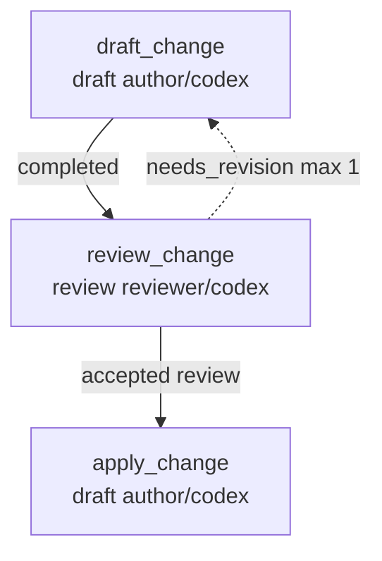

# Writing Workflows

This guide is for authoring a `workflow.json` from scratch (or
from a starter scaffold) and validating it against the runner.
For the AI-operator commands that consume a workflow, see
[HOW_TO_AGENT.md](HOW_TO_AGENT.md). For human-principal
escalations, see [HOW_TO_HUMAN.md](HOW_TO_HUMAN.md).

## Choose the workflow type first

Start with [WORKFLOW_TYPES.md](WORKFLOW_TYPES.md) before editing
JSON. It explains the current workflow families, shows the graph
shapes, distinguishes starter scaffolds from examples, and states the
current default behavior: striatum never auto-selects a runtime
workflow for a repository, while `workflow init` defaults to the
`review` scaffold style when `--style` is omitted.

## Start from an example

Start from `examples/rfc-ledger-cleanup/workflow.json`. For
smaller fixtures, see `examples/docs-review-flow/`,
`examples/code-change-flow/`,
`examples/failed-review-revision-cycle/`,
`examples/human-checkpoint-flow/`, and
`examples/adapter-unavailable-flow/`.

Or scaffold a new tree:

```bash
striatum workflow init --style review path/to/new-flow
```

`--style` accepts `minimal`, `review` (default), or `code-change`.
The generated tree includes `workflow.json` plus `roles/` and
`prompts/` stubs and validates cleanly. The command refuses to
overwrite an existing path.

For more control, generate from the template catalog:

```bash
striatum workflow templates list
striatum workflow generate workflows/my-change \
  --shape code_change \
  --lane-set author_reviewer \
  --artifact-root striatum/my-change \
  --lane-command author='["codex","exec"]' \
  --lane-command reviewer='["codex","exec"]' \
  --dry-run --json
```

The dry-run envelope contains the compiled workflow, generated files,
graph metadata, warnings, and validation result. Removing `--dry-run`
writes `workflow.json`, role stubs, and prompt stubs, then revalidates
the written file. V1 refuses overwrites; edit the generated workflow
afterward when you need fields the generator does not expose.

## Required top-level fields

`schema_version`, `workflow_id`, `workflow_version`, `name`,
`branch`, `coordinator`, `lanes`, `roles`, `context_docs`,
`parallelism`, `jobs`, `edges`, `cycles`.

`schema_version` is `striatum.workflow.v1` for V1 workflows.

## Common job fields

`id`, `type`, `title`, `role_id`, optional `lane_id`, `objective`,
`task_prompt`, `inputs`, `write_scope` (`allowed_paths`,
`forbidden_paths`), `expected_artifacts` (`logical_name`, `kind`,
`path`, `required`), `fresh_session_required`, and
`parallel_group`.

## Choose lanes deliberately

Workflow type chooses the graph; lane selection chooses the execution
surface. A lane is a named adapter configuration, not a provider
identity. The runner does not infer that a lane named `codex` or
`reviewer` has any special behavior; behavior comes from the lane's
adapter, command, constraints, capabilities, and optional harness
profile.

For real runs, prefer explicit `lane_id` values on jobs. If a job
omits `lane_id`, the queued work is not lane-constrained and any
matching role session may claim it. That can be useful for manual
operation, but it makes later audit and repeatability weaker.

Common lane sets:

- **single-lane starter**: one lane handles authoring, review, and
  synthesis. Good for small or operator-by-hand runs.
- **author plus reviewer**: author jobs and review jobs bind to
  separate lanes, usually with `fresh_session_required: true` on the
  review jobs.
- **multi-review fan-out**: several review jobs bind to distinct
  lanes, often different model families, and converge into a ledger or
  synthesis job.
- **supervised lane**: a process-adapter lane driven by
  `striatum supervise`; by default, use a command or wrapper that can
  read newline-delimited work packets from a persistent stdin FIFO.
  For single-prompt commands that require stdin EOF before doing work,
  set `supervision.stdin_delivery: "one_shot_eof"`.
- **worktree-isolated lane**: a repo-write lane with
  `worktree_isolation: "per_job"` when parallel writes need isolated
  git worktrees.
- **constrained lane**: a lane with `constraints` and
  `required_enforcement` when network, transcript, or repo-scope policy
  should be visible and validation-checked.

Minimal process lane:

```json
{
  "lanes": {
    "agent": {
      "adapter": "process",
      "display_model": "Your Agent Model",
      "command": ["your-agent-cli", "run-from-stdin"],
      "capabilities": ["write", "review", "synthesis"]
    }
  }
}
```

Replace the placeholder command with the actual invocation shape your
agent CLI expects.

For the operator-facing lane selection matrix, see
[WORKFLOW_TYPES.md § "Lane Selection Heuristic"](WORKFLOW_TYPES.md#lane-selection-heuristic).

## Adapter constraints

Lane configs may declare adapter constraints:

```json
{
  "constraints": {
    "network": "forbidden",
    "transcripts": "off",
    "repo_scope": "local_only"
  },
  "required_enforcement": {
    "network": "advisory_strict",
    "transcripts": "enforced"
  }
}
```

V1 records the requested constraint, the required enforcement
level, the adapter's actual enforcement (`enforced`,
`advisory_strict`, `advisory`, or `unsupported`), and satisfaction
status in work packets. Validation rejects a lane when
`required_enforcement` asks for a level the adapter cannot
provide. The local process adapter enforces transcript-off,
scrubs proxy env vars when network is forbidden, and sets
`STRIATUM_NETWORK_POLICY` and `STRIATUM_REPO_SCOPE` sentinels so
cooperating agents can honor the policy.

## Shape a custom run scaffold

A striatum run starts from a concrete design proposal, not from a
project type. The proposal can be an RFC, TODO, bug report,
feature request, review finding, support note, or any other local
artifact that describes the desired change or decision. Keep that
source artifact in the target repository and reference it from
`context_docs` or the relevant job `inputs`.

Before editing `workflow.json`, choose the run outcome. For the
full selection guide and diagrams, see
[WORKFLOW_TYPES.md](WORKFLOW_TYPES.md). The short version:

- **review only**: independent reviewers inspect the source
  proposal, publish findings, and a synthesis job produces the
  durable recommendation.
- **produce a spec**: reviewers or researchers feed a
  spec-authoring job, then a review gate checks the generated
  spec before the run ends.
- **produce a spec and implement**: the spec path continues into
  implementation, build or test verification, and final review.
- **repair implementation**: a bug report, failing review, or
  smoke-test finding feeds an implementation job and a focused
  verification job.
- **human checkpoint**: the runner records a required owner
  decision before later jobs become claimable.

Use `workflow init --style review` for proposal review, RFC
cleanup, bug triage, feature request analysis, and TODO
conversion. Use `--style code-change` when the same scaffold
should also drive repository edits. Use `--style minimal` for a
single bounded job or when you want to build the graph from
scratch.

`shape: "custom"` is not raw workflow JSON. It accepts a
`striatum.workflow_plan.v1` plan with closed block kinds:
`draft`, `review`, `synthesis`, `implementation`, `test`,
`human_checkpoint`, `support_ledger`, `evidence_audit`, and
`final_review`. Base edges must be acyclic; loops are declared only
through bounded `cycles`; every custom block must have a lane binding.

## Scaffold layout

Choose a repo-relative scaffold root such as `workflows/<slug>/`
or `docs/workflows/<slug>/` in the target repository. A reusable
scaffold usually contains:

```text
<scaffold-root>/workflow.json
<scaffold-root>/RUNBOOK.md
<scaffold-root>/SOURCES.md
<scaffold-root>/roles/*.md
<scaffold-root>/prompts/*.md
```

`workflow.json` is the executable contract. `RUNBOOK.md` is for
the AI operator, `SOURCES.md` records the local proposal and
context artifacts, and role or prompt files hold reusable task
wording. Workflow outputs should land in durable repo paths.
Keep runner state in `.striatum/`; do not publish transcripts as
workflow artifacts.

## Recommended output layout

striatum has no built-in output directory. The location of every
artifact is whatever your workflow's `expected_artifacts[].path`
and `write_scope.allowed_paths` say. If you don't have a strong
project-specific opinion about where the runner's output should
land, the recommended convention is:

```text
<your-repo>/
├── .striatum/                 # gitignored; operational scratch
└── striatum/                  # committed; durable workflow output
    └── <workflow-slug>/
        ├── RUN_SUMMARY.md
        ├── RUN_EVIDENCE.md
        ├── <draft>.md
        ├── <reviewer>/
        │   └── <review>.md
        └── final/
            └── <final-review>.md
```

The pair `.striatum/` (scratch, gitignored) and `striatum/`
(provenance, committed) is a clean visual reminder of the
distinction the runner makes between daemon-owned live state and
durable artifacts. It also makes "remove all striatum output" a
single `rm -rf striatum/` for first-contact users who want to try
the runner without scattering files across `docs/`.

If your project already has an artifact convention (`docs/reviews/`,
`docs/specs/`, `docs/decisions/`, `evidence/`, etc.), use it.
The runner does not care; it accepts every path the workflow
declares.

In `workflow.json` this looks like:

```json
{
  "id": "draft_change",
  "type": "build",
  "write_scope": {
    "mode": "repo_write",
    "allowed_paths": ["striatum/<workflow-slug>/"],
    "forbidden_paths": [".striatum/"]
  },
  "expected_artifacts": [
    {
      "logical_name": "draft",
      "kind": "handoff",
      "path": "striatum/<workflow-slug>/DRAFT.md",
      "required": true
    }
  ]
}
```

`evidence export` and `run summary` are operator commands; you
pass their `--path` on the command line. They have to be inside
the repo and outside `.striatum/`, but otherwise the runner does
not enforce a layout. Putting them under
`striatum/<workflow-slug>/` keeps the convention consistent.

## Common graph shapes

These are shorthand reminders. For the more complete selection
guide with Mermaid diagrams, see
[WORKFLOW_TYPES.md](WORKFLOW_TYPES.md).

```text
review_a + review_b + review_c -> findings_ledger -> synthesis -> final_review
proposal_review -> spec_author -> spec_review
proposal_review -> spec_author -> spec_review -> implement -> build_review
bug_triage -> implement_fix -> smoke_test -> final_review
proposal_review -> synthesis -> human_checkpoint -> implement
```

## Reviewer policy fields

Give independent reviewers `review_only_artifact` write scopes
and `fresh_session_required: true`. Give authoring and
implementation jobs `repo_write` only for the files they are
expected to change. Parallel jobs should have disjoint output
paths, and every expected artifact should have a stable path
under the target repository and outside `.striatum/`.

For the full reviewer policy field set
(`reviewer_access_scope`, `reviewer_context_policy`), see
[SPEC.md § Reviewer Policy](SPEC.md#reviewer-policy).

## Harness profiles (RFC 0010)

Workflows may declare an optional top-level `harness_profiles`
map and reference one profile per lane via `harness_profile_id`.
When set, the runner adds a `harness_profile` block to the lane's
work packets with the profile body verbatim plus a `profile_id`
key. Workflows that omit `harness_profiles` produce identical
packets to before — the field is fully additive.

The reference fixture lives at
`examples/harness-profiles/workflow.json`. The shipped supervised
wrappers live at
`.striatum/bin/{claude,codex,gemini}-supervised-wrapper.sh` (RFC
0010 V2, RFC 0063 follow-through). Workflows that declare supervised
Claude Code, Codex, or Gemini lanes can use the matching wrapper as
the lane command directly.

Process lanes that call a raw single-prompt command such as
`["codex", "exec", "--model", "gpt-5.5", "-"]` should declare:

```json
"supervision": {
  "stdin_delivery": "one_shot_eof"
}
```

That opt-in gives the command one packet on stdin and then EOF. The default
remains the persistent FIFO mode for wrappers that handle multiple packets.

For the full harness-profile schema (recognised tool families,
required fields, accountability rules), see
[SPEC.md § Harness Profiles (RFC 0010 V1)](SPEC.md#harness-profiles-rfc-0010-v1).

## Validate before you ship

Before preparing a run, check the scaffold:

```bash
striatum --repo "$TARGET_REPO" workflow validate path/to/workflow.json --json
striatum --repo "$TARGET_REPO" workflow plan path/to/workflow.json --json
striatum --repo "$TARGET_REPO" workflow graph path/to/workflow.json
```

Review the plan for the intended branch name, job order, write
scopes, required artifacts, and any principal escalations. Avoid
absolute home-directory paths in workflow fixtures; use
repo-relative paths and operator-local environment variables
instead.

## View a rendered graph

Mermaid-capable Markdown renderers display `workflow graph`
output as a visual diagram. For example,
`examples/code-change-flow/workflow.json` renders as (your own
workflow renders similarly with its own jobs and edges):



Generate the same source from the striatum checkout with:

```bash
striatum --repo . workflow graph examples/code-change-flow/workflow.json
```

`--format` accepts `mermaid` (default), `dot` (Graphviz source),
or `json` (machine-readable graph data). When Graphviz is
installed, render an SVG with:

```bash
striatum --repo . workflow graph examples/code-change-flow/workflow.json --format dot \
  | dot -Tsvg -o workflow-graph.svg
```

For state-annotated graphs of a *running* run, see
[HOW_TO_HUMAN.md § "Dashboards and graphs"](HOW_TO_HUMAN.md#dashboards-and-graphs).
