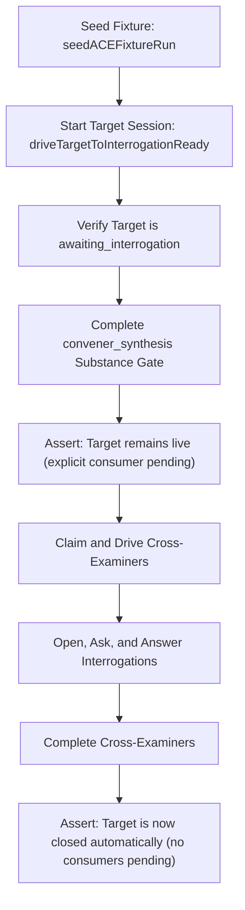

# Proposal C: Fixture-First Implementation and Conformance Verification Plan for RFC 0112

author: proposer-c-gemini-3.5-flash-high-001
date: 2026-06-05
run: rfc-0112-explicit-interrogation-consumers-design-panel
logical_name: proposal_c
kind: handoff

---

## 1. Executive Summary & Option C Vision

Option C frames the implementation of RFC 0112 around a **fixture-first validation methodology**. Because explicit interrogation consumers affect critical scheduling pathways, liveness predicates, and session retirement, we must define the test fixtures *first*. Under Option C, we construct a standing CI gate using the unattended reliability harness (RFC 0105) to prove that the Adjudicated Constraint Extraction (ACE) shape can graduate to `supported` (RFC 0106).

This plan answers the six design questions with concrete technical specifications, schema/validation invariants, and Go code structures designed to execute cleanly within the Striatum daemon.



---

## 2. Answers to the Six Design Questions

### Q1: `interrogation_targets` Field Name & Shape
We adopt and confirm the V1 per-entry shape `{workflow_job_id, required}` inside the `interrogation_targets` array on a consumer job.

#### Exact Schema Definition
In `definitions.job.properties` within the workflow snapshot schema:
```json
"interrogation_targets": {
  "type": "array",
  "items": {
    "type": "object",
    "properties": {
      "workflow_job_id": { "type": "string" },
      "required": { "type": "boolean", "default": false }
    },
    "required": ["workflow_job_id"],
    "additionalProperties": true
  }
}
```

#### Validation Rules (Enforced at `workflow validate` and `run.prepare`)
1. **Target Existence**: The targeted `workflow_job_id` must exist in the same workflow snapshot definition.
2. **Liveness Capability**: The target job must declare `interrogable: true`.
3. **DAG Reachability**: The consumer job must be downstream of the target job in the workflow graph (DAG). There must be a valid directed path from target to consumer.
4. **Non-Self-Referential**: A job cannot target itself.
5. **Unknown Field Treatment**: Inside an `interrogation_targets` entry, unknown fields are parsed but generate a **lint warning** in V1 rather than a hard failure to support seamless future extensions.

---

### Q2: `required` Semantics in V1
In V1, `required: true` carries **packet instruction strength only**. 

- It signals to the consumer lane that it is expected to open and complete an interrogation session against the target before finalization.
- **Advisory Fallback**: If the target's session has already retired or is unavailable (raising `interrogation_unavailable`), the lane proceeds using the target's published artifact. The fallback remains non-wedging.
- **Gate Staging**: No database-level blocking validator is introduced on `work.complete` or `review.submit` for V1. Hard gates are deferred to V2 (after stability is proven in CI).
- **Event Logging**: Surfacing an unavailable target in a work packet does *not* write a durable event. A durable event (`interrogation.unavailable_observed`) is written only when the consumer lane explicitly calls `interrogation.open` and receives the non-wedging signal.

---

### Q3: Multiple Targets in V1
We allow **multiple targets** (`N` entries) in the `interrogation_targets` array per consumer job in V1.

- **Use Case**: Multi-synthesis panels or collaborative review cycles where a consumer must contrast several upstream draft contexts.
- **Liveness Predicate**: The target session's window is held open as long as *any* consumer job (direct dependent OR explicit declarer) remains non-terminal.
- **Packet behavior**: The work packet's projection maps all targets independently inside `context.interrogation_targets[]`, reflecting each target's session ID and individual state.

---

### Q4: Terminal Paths for the Release Hook
We replace `releaseInterrogationTargetForCompletedReview` with a generalized terminal-job hook:
```go
func releaseInterrogationTargetsForTerminalConsumer(ctx context.Context, runner db.Runner, repositoryID, runID, jobID string) error
```

#### Mutation Hook Points
The generalized hook must be invoked inside the same transaction of all job-terminalizing mutations:
1. **`work.complete`**: When a build, synthesis, test, or generic job completes.
2. **`review.verdict` / `submit-review`**: When a reviewer submits a verdict (`accept`, `needs_revision`, etc.).
3. **`override-verdict`**: When an operator manually overrides a verdict.
4. **`recovery.cancel-job` / `recovery.auto` / `run.cancel`**: When a supervisor cancel-sweep transitions a consumer job to `canceled` or `failed`.

#### Bypass Guard
To ensure future mutations do not bypass window closure, we place the hook invocation inside the central transaction helper `db.WithJobStateTransition` or equivalent handler dispatch wrapper. Additionally, a unit test assertion validates that every mutation method transitioning a job's state to a terminal value executes this hook.

---

### Q5: The RFC 0105 Conformance & Chaos Fixtures
We introduce three distinct test fixtures in `go/pkg/adapterconformance/` to verify liveness, recovery, and revision loops under the production daemon.

| Fixture Name | Focus | Injected Fault | Expected Outcome |
| :--- | :--- | :--- | :--- |
| `TestACEExplicitInterrogationHappyPath` | Liveness & Multi-Consumer | None | Both cross-examiners claim and interrogate `convener_draft`; window stays open until the final examiner completes. |
| `TestACEExplicitInterrogationRevision` | Revision-Reopen & Re-arm | None | `adjudicate` triggers `needs_revision` on `convener_draft`. Old target session is retired; new attempt session is created, claimed, and successfully interrogated. |
| `TestACEExplicitInterrogationFault` | Recovery Sweep & Dead Lane | Mid-task lane death | One cross-examiner dies mid-task. The recovery sweep requeues the job on the same attempt; target session survives and the new worker completes the interrogation. |

---

### Q6: The Work-Packet Namespace
The resolved targets are projected into the work packet under `context.interrogation_targets`:

```json
{
  "context": {
    "interrogation_targets": [
      {
        "workflow_job_id": "convener_draft",
        "required": true,
        "target_session_id": "sess_target_123",
        "state": "available",
        "instruction": "Open interrogation against target_session_id before recording findings."
      }
    ]
  }
}
```

#### State Definitions
- **`available`**: Target session is live, attested, and in the `awaiting_interrogation` state.
- **`unavailable`**: Target completed its attempt, but the panel window has closed (all consumers finished).
- **`not_ready`**: Target job has not yet completed its work or registered its interrogation session.

---

## 3. Database Query & Predicate Generalization (Go / PG)

Under Option C, we extend `interrogationConsumersPending` in `go/pkg/mutations/interrogation.go` without changing the schema, querying the parsed `workflow_json` snapshot already persisted in the database.

### Extended Liveness Predicate SQL
```go
func interrogationConsumersPending(ctx context.Context, runner db.Runner, repositoryID, runID, interrogableJobID string) (bool, error) {
	return existsRow(ctx, runner, `
		WITH explicit_consumers AS (
			SELECT j.job_id
			  FROM striatumd.jobs j
			  JOIN striatumd.runs r 
			    ON r.repository_id = j.repository_id AND r.run_id = j.run_id
			  JOIN striatumd.workflow_snapshots ws 
			    ON ws.repository_id = r.repository_id AND ws.workflow_snapshot_id = r.workflow_snapshot_id
			  CROSS JOIN LATERAL jsonb_array_elements(ws.workflow_json->'jobs') AS wj
			  CROSS JOIN LATERAL jsonb_array_elements(wj->'interrogation_targets') AS target
			 WHERE j.repository_id = $1 
			   AND j.run_id = $2
			   AND j.workflow_job_id = wj->>'id'
			   AND target->>'workflow_job_id' = $3
			   AND j.state NOT IN `+terminalInterrogationConsumerStates+`
		),
		direct_consumers AS (
			SELECT j.job_id
			  FROM striatumd.job_dependencies dep
			  JOIN striatumd.jobs j 
			    ON j.repository_id = dep.repository_id AND j.job_id = dep.job_id
			 WHERE dep.repository_id = $1 
			   AND j.run_id = $2
			   AND dep.depends_on_job_id = $3
			   AND j.state NOT IN `+terminalInterrogationConsumerStates+`
		)
		SELECT 1 FROM (
			SELECT job_id FROM explicit_consumers
			UNION
			SELECT job_id FROM direct_consumers
		) combined LIMIT 1`, repositoryID, runID, interrogableJobID)
}
```

> [!NOTE]
> By querying the snapshot's `workflow_json` dynamically using `jsonb_array_elements`, we avoid the need for a structural schema migration on `striatumd.jobs` or `striatumd.job_dependencies`. This satisfies the constraint of minimizing the schema blast radius while keeping database-level verification robust.

---

## 4. Risks & Rejected Alternatives

- **Fake Adjacency Edges (Rejected)**: Adding false scheduling dependency edges from `convener_draft` to cross-examiners to bypass the predicate. This breaks RFC 0045 phase constraints and distorts the scheduler's reopen cascade.
- **Leaked Session Risk (Mitigated)**: If a recovery sweep fails to trigger the release hook, target sessions could leak. We mitigate this by registering `releaseInterrogationTargetsForTerminalConsumer` inside the central job-state transaction wrapper.
- **Migration Skew (Mitigated)**: Snapshot versions without `interrogation_targets` fallback automatically to direct-dependent query matching, maintaining 100% backward compatibility for existing simple review panels.
