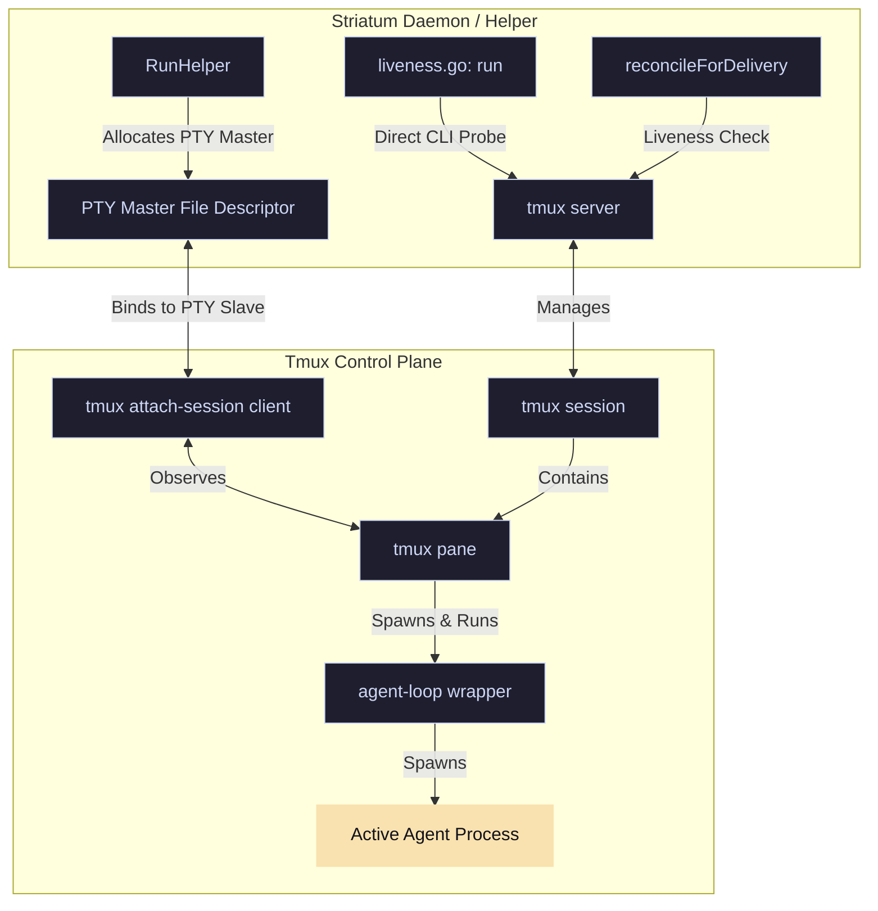
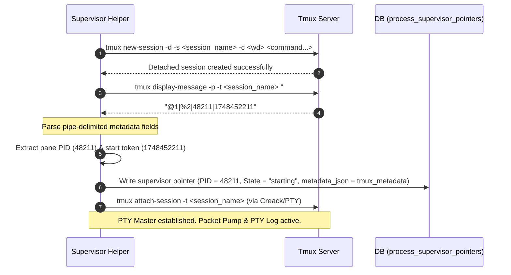
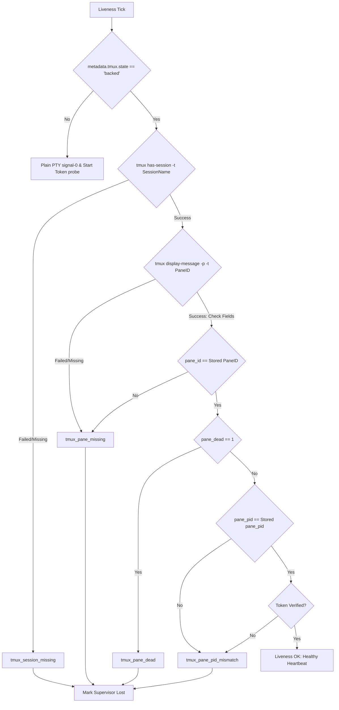

# Design: Tmux Session/Pane Liveness (Phase 1)
**Lane ID**: `agy`
**Status**: `Proposed`
**Date**: 2026-05-28
**Author**: `designer-gemini-3.5-flash-high-001`

---

## 1. Executive Summary & Philosophy

Under the paradigms introduced in **RFC 0088**, Striatum standardizes on persistent, daemon-owned interactive PTY lanes for agent runners. While this enables critical continuity features like context preservation and seamless interactive resumption, it couples the supervised process's liveness directly to the lifetime of the PTY attach client.

Currently, `go/pkg/supervisor/pty.go::launchPTY` starts a detached tmux session and immediately spawns a `tmux attach-session` client, returning its PID as the supervised process ID. If an operator detaches (e.g., `Ctrl-b d`), the terminal hangup triggers `EIO` or SIGHUP, the attach client exits, and the supervisor falsely concludes the lane is `lost` or `gone`, terminating active MCP transactions and invalidating attestation.

This design presents the implementation plan for **RFC 0089 Phase 1**:
- **Decouple packet transport/observation** (`tmux attach-session`) from **lane liveness** (the real tmux session and pane process).
- **Proclaim the tmux pane process** as the actual supervised identity.
- **Probe the tmux session and pane directly** to determine liveness, ignoring transient attach client exits.
- **Reroute teardown operations** (`supervise.stop`) to target the tmux session rather than transient clients.



> [!IMPORTANT]
> Keep **D028** and **D151** intact: raw tmux pane text is strictly for local diagnostics only. It must never enter the database, be captured in trajectory/event payloads, or affect workflow state or verdict outcomes.

---

## 2. Decoupled Tmux Launch Process

To shift from attach-client tracking to real tmux pane tracking, we perform a multi-stage query sequence at launch.

### 2.1 The Decoupled Launch Sequence

The launch process creates the detached session, captures the exact identifiers, registers them in the database, and then attaches an observer client.



### 2.2 Identity Capture Details

In `go/pkg/supervisor/pty.go::launchPTY`, immediately after executing `tmux new-session` and configuring options (e.g., status bar off):
1. **Query Session Metadata**: Execute `tmux display-message -p -t <sessionName> "#{window_id}|#{pane_id}|#{pane_pid}|#{pane_start_time}"`.
2. **Parse pipe-delimited fields**:
   - `WindowID`: The absolute tmux window ID (e.g., `@3`).
   - `PaneID`: The absolute tmux pane ID (e.g., `%4`).
   - `PanePID`: The OS process ID of the shell running inside the pane.
   - `PaneStartToken`: The process start time (epoch seconds or formatted ticks).
3. **Handle Best-Effort Start Time**:
   - If `pane_start_time` is unavailable (e.g., older tmux versions), fall back to `processStartToken(pane_pid)` using standard OS probes.
   - If both are missing, write `pane_start_token` as `""`. Downstream checks treat an empty token as `start_token_unverified` instead of failing, accommodating limited environments.
4. **Tear down on failure**: If the query fails, any critical identifier is empty, or `pane_pid <= 0`, tear down the half-built session (`tmux kill-session -t <name>`). If `RequireTmux` is active, return an error; otherwise, fall back to `launchPlainPTY` with `state: "unavailable"`.

---

## 3. Metadata Shape & Database Mapping

### 3.1 Extended JSON Metadata

All metadata resides in the standard `metadata_json` column of the `process_supervisor_pointers` and `process_supervisors` tables, avoiding the need for DDL database schema migrations. The existing `tmux` block is extended with a explicit `state` discriminator and first-class pane properties:

```jsonc
"tmux": {
  "state":             "backed", // "backed" | "unavailable"
  "session_name":      "striatum-run_1-lane_1-sup_1",
  "window_id":         "@3",
  "pane_id":           "%4",
  "pane_pid":          48211,             // The actual supervised lane PID
  "pane_start_token":  "1748452211",      // Verified process start time
  "attach_command":    "tmux attach-session -t striatum-run_1-lane_1-sup_1",
  "attach_client_pid": 48309,             // Transient PTY observer PID
  "captured_at":       "2026-05-28T16:12:19Z"
}
```

If tmux is not installed or the environment fails to initialize tmux, the plain-PTY fallback is logged:

```jsonc
"tmux": {
  "state":              "unavailable",
  "unavailable_reason": "tmux_not_found"
}
```

### 3.2 Code Structures to Change

#### `go/pkg/supervisor/pty.go`
Update `LaunchResult` to store `AttachPID` separately, and return the `pane_pid` as `PID` for tmux-backed lanes:

```go
type LaunchResult struct {
	PID         int            // pane_pid for tmux-backed; child pid for plain PTY
	StdinWriter io.WriteCloser // PTY Master handle for packet delivery
	Cmd         *exec.Cmd      // tmux attach *exec.Cmd
	AttachPID   int            // PID of the transient attach client
	Metadata    map[string]any // JSON metadata containing extended tmux fields
}
```

#### `go/pkg/supervisor/pointer.go`
Extend the `PointerRow` struct with explicit fields mapped from the jsonb column:

```go
type PointerRow struct {
	SupervisorID    string
	RepositoryID    string
	SessionID       string
	PID             int
	StartedAt       time.Time
	LastHeartbeatAt time.Time
	StdinPipePath   string
	State           string
	LostReason      string
	PIDStartTime    string
	Metadata        map[string]any

	// Extended Tmux Fields
	TmuxSessionName string
	TmuxWindowID    string
	TmuxPaneID      string
	TmuxPanePID     int
	TmuxStartToken  string
}
```

---

## 4. Unified Liveness Probing & Heartbeat

A new module `go/pkg/supervisor/tmux_liveness.go` handles liveness checking. All system calls and command executions route through this isolated utility.

### 4.1 Upgraded Liveness Decision Path

The liveness tick runs every 5 seconds. If the supervisor pointer metadata indicates `tmux.state == "backed"`, a multi-stage check is performed:



### 4.2 Liveness Failure Classifications

| Class | Cause | Action / Treatment |
| --- | --- | --- |
| `tmux_ok` | Session exists, pane is alive, and PID + start token match. | Keep state as `running`/`alive`. Attestation stands. |
| `tmux_session_missing` | `tmux has-session` returns non-zero. | State transitions to `lost` (reason: `tmux_session_missing`). |
| `tmux_pane_missing` | `display-message` fails or `pane_id` is mismatched. | State transitions to `lost` (reason: `tmux_pane_missing`). |
| `tmux_pane_dead` | Pane exists, but `pane_dead == 1`. | State transitions to `lost` (reason: `tmux_pane_dead`). |
| `tmux_pane_pid_mismatch` | Pane is active, but PID or start token differs (PID recycle). | State transitions to `lost` (reason: `tmux_pane_pid_mismatch`). |
| `tmux_unavailable` | Tmux binary not found in PATH or probe timed out (>2s). | Skip heartbeat tick. If 3 consecutive ticks fail (~15s) $\rightarrow$ `lost` (`tmux_unavailable_persistent`). |

> [!TIP]
> The transient outage policy protects against temporary environmental flaps (e.g., high IO wait or brief server lag). A single `tmux_unavailable` timeout does not immediately kill the lane.

### 4.3 Integration Callsites

The unified helper `ProbeLaneLiveness` handles the routing internally:

```go
func ProbeLaneLiveness(ctx context.Context, r TmuxRunner, metadata map[string]any, pid int, expectedStartToken string) LaneLiveness
```

1. **Heartbeat Poll (`go/pkg/supervisor/liveness.go`)**: Polled every 5 seconds. Transition to `lost` on hard failures.
2. **Delivery Reconciliation (`go/pkg/mutations/supervision_control.go`)**: Pre-delivery check before writing packets to the FIFO. If the probe yields `tmux_unavailable`, delivery is rejected with `invalid_transition` rather than retrying silently.
3. **Read Projections (`go/pkg/reads/supervision.go`)**: Populates the new `tmux.liveness` sub-block in `supervise.status`, `dashboard`, and `dashboard_all`. Top-level status remains `"alive"` or `"gone"` for backwards compatibility.
4. **Recovery Sweep (`go/pkg/mutations/recovery.go`)**: Sweep process joins `process_executions` to the supervisor pointer table to pull metadata and evaluate liveness correctly.
5. **Doctor CLI (`go/pkg/reads/doctor.go`)**: Reports failure classes and remediation hints when verbose is requested.

---

## 5. Decoupled Stop Mechanics

`HandleSuperviseStop` (`go/pkg/mutations/supervision_control.go`) is rewired to target the tmux session rather than the attach client.

1. **Load Metadata**: Extract `tmux.state` and `tmux.session_name` from the supervisor pointer.
2. **Tmux Kill**: If `state == "backed"`, run `tmux kill-session -t <session_name>` with a 2-second timeout.
   - If the session is already missing, treat the stop as successful and idempotent, log the class, and proceed.
3. **Observer and Helper Cleanup**: As an idempotent step, SIGTERM the `AttachPID` and the helper PID. Since the tmux session is terminated, these processes will already be exiting.
4. **Mark Status**: Mark all supervisor rows `stopped` in the database.
5. **JSON Response**: Set the returned `signal` key to `tmux_kill_session` to distinguish this path from standard OS signal termination.

---

## 6. Test Suite Plan

All new testing files are gated behind `exec.LookPath("tmux")` checks so environments lacking tmux skip elegantly instead of failing.

### 6.1 Unit Tests (`go/pkg/supervisor/tmux_liveness_test.go`)

- **`TestProbeOK`**: Program mock runner to succeed on `has-session` and return matching metadata. Assert `TmuxLivenessOK`.
- **`TestProbeSessionMissing`**: Program mock runner to fail on `has-session`. Assert `TmuxLivenessSessionMissing`.
- **`TestProbePaneMissing`**: Session exists but `display-message` fails or returns mismatched pane ID. Assert `TmuxLivenessPaneMissing`.
- **`TestProbePaneDead`**: Session exists but returns `pane_dead = 1`. Assert `TmuxLivenessPaneDead`.
- **`TestProbePIDMismatch`**: Pane is alive but returns a recycled/different PID. Assert `TmuxLivenessPanePIDMismatch`.
- **`TestProbeStartTokenMismatch`**: PID matches but `pane_start_time` differs from captured launch metadata. Assert `TmuxLivenessPanePIDMismatch`.
- **`TestProbeStartTokenEmptyIsUnverified`**: If launch metadata start token is empty, return `TmuxLivenessOK` with `detail = "start_token_unverified"`.
- **`TestProbeNeverReadsPaneText`**: **D028 Guard**. Verify the runner mock receives **zero** commands containing `capture-pane`, `pipe-pane`, `save-buffer`, `show-buffer`, `copy-mode`, or `select-pane -P`.

### 6.2 Integration Tests (`go/pkg/supervisor/tmux_liveness_integration_test.go`)

- **`TestIntegrationAttachClientExitDoesNotKillProbe`**: Spawn a real detached tmux session running `sleep 60`. Start and immediately kill an attach client. Assert that `ProbeTmuxLiveness` continues to report `TmuxLivenessOK` against the pane.
- **`TestIntegrationSessionKillIsSessionMissing`**: Start a session, capture identity, execute `tmux kill-session`, and verify liveness transitions to `TmuxLivenessSessionMissing`.
- **`TestIntegrationShortSleepIsPaneDeadOrPidMismatch`**: Run a fast-exiting command, assert it is reported as `lost` under either `tmux_pane_dead` or `tmux_pane_pid_mismatch`.

### 6.3 Helper Tests (`go/pkg/supervisor/helper_test.go` - Extension)

- **`TestRunHelperAttachClientExitWithLivePaneIsNotLost`**: Mock `Launch` to return an attach surrogate that exits, while the pane surrogate remains alive. Verify the helper emits `attach_client_exited` and exits with code 0, rather than emitting `agent_exited`.
- **`TestRunHelperRecordsPanePIDNotAttachPID`**: Verify the initial `agent_started` payload contains the pane PID as `pid` and the attach client's PID as `attach_client_pid`.

---

## 7. Fallback, Rollback, & Environment Control

### 7.1 Fallback Policy

If `tmux` is absent in PATH or fails to initialize:
- **`RequireTmux == true`**: Fail closed immediately at launch, throwing `tmuxRequiredError` with reason `tmux_not_found`.
- **`RequireTmux == false`**: Log a diagnostic warning, fall back to a plain PTY wrapper (`launchPlainPTY`), and record `tmux.state = "unavailable"` in the supervisor metadata.

### 7.2 Rollback Knobs

- **`STRIATUM_TMUX_PROBE_DISABLE=1`**: A daemon environment variable. When set, `ProbeLaneLiveness` immediately falls through to the legacy pid-probe path, collapsing all production systems back to non-tmux liveness behaviors without code redeployment.
- **DDL-Free Metadata Store**: Since all tmux pane properties are nested inside the standard `metadata_json` column and the standard `pid` column is mapped to the pane PID, a code rollback to the previous supervisor version will seamlessly signal-0 the pane PID, causing zero schema incompatibility.

---

## 8. Summary of Document Updates & Files to Change

### 8.1 Files to Change

| File Path | Function / Block | Change Description |
| --- | --- | --- |
| `go/pkg/supervisor/pty.go` | `LaunchResult` struct | Add `AttachPID` field. |
| `go/pkg/supervisor/pty.go` | `launchPTY` | Query tmux metadata via `display-message` before attaching; return pane PID as `PID` and attach client PID as `AttachPID`. |
| `go/pkg/supervisor/pointer.go` | `PointerRow` struct | Add extended tmux fields. |
| `go/pkg/db/supervisor_pointers.go` | `Upsert`/`Get` | Map the new tmux properties in `metadata_json` to struct fields. |
| `go/pkg/supervisor/tmux_liveness.go` | New File | Implement `ProbeTmuxLiveness` and `ProbeLaneLiveness`. |
| `go/pkg/supervisor/helper.go` | `RunHelper` | Update exit interception to emit `attach_client_exited` when the pane is still alive. |
| `go/pkg/mutations/supervision_control.go`| `HandleSuperviseStop` | Rewire stop to terminate the session using `tmux kill-session`. |

### 8.2 Handoff & Verification Verification

> [!NOTE]
> After RFC 0089 Phase 1, RFC 0088 agent-loop lanes can be flipped to tmux-backed by default with a workflow.json / daemon-config change alone; no further code change is required.
