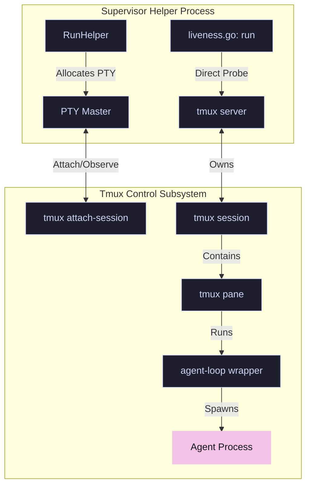
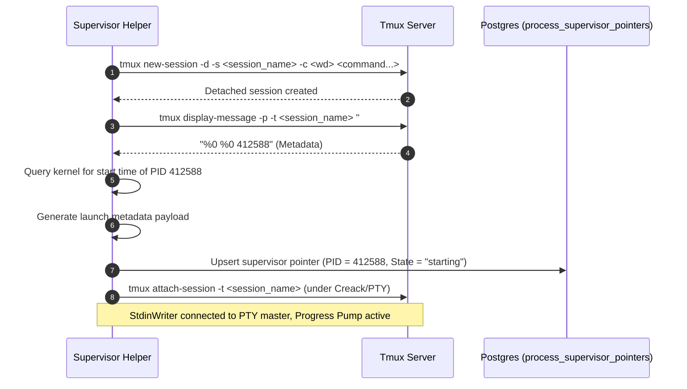
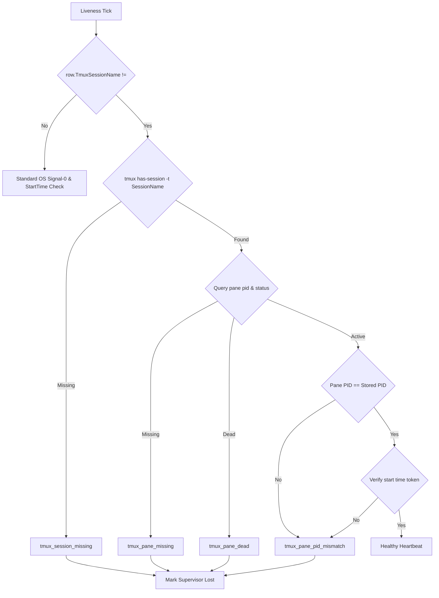

# Design: Tmux Session/Pane Liveness (Phase 1)
**Lane ID**: `agy`
**Status**: `Proposed`
**Date**: 2026-05-28

---

## 1. Executive Summary & Philosophy

In **RFC 0088**, Striatum established long-lived, interactive PTY sessions as the standard for agent lanes. While this provides persistent agent memory and contextual continuity, it introduces a critical operational challenge: **liveness telemetry is currently coupled to transient client lifetimes**.

Today, `go/pkg/supervisor/pty.go` launches `tmux new-session` and immediately returns the PID of `tmux attach-session` as the supervised identity. If an operator detaches, if the terminal window closes, or if the supervisor's private attach client experiences a PTY glitch, the lane is falsely reported as `lost` ("process_exited").

This design independently outlines **Phase 1 of RFC 0089**, completely decoupling **control attach streams** from **liveness status monitoring**.

### Core Architecture Philosophy



> [!IMPORTANT]
> The `tmux attach-session` client is strictly an **observer interface**. It may exit, restart, or crash without impacting the supervisor's liveness classification or interrupting the active agent process inside the tmux pane.

---

## 2. Decoupled Tmux Launch Process

To stop treating `tmux attach-session` as the lane identity, we must perform a two-step query at launch:
1. Initialize the detached tmux session.
2. Query the tmux daemon for the newly created pane's **actual PID** and its kernel-reported **start time** (the start token).

### Launch Sequence Detail


---

## 3. Exact Code Changes

### A. `go/pkg/supervisor/pty.go`
We will rewrite `launchPTY` to query tmux metadata right after session creation and before attaching. We will return the **pane PID** as the `PID` in `LaunchResult`.

```diff
 func launchPTY(ctx context.Context, supervisorID string, spec LaunchSpec) (*LaunchResult, error) {
   runID := getEnvValue(spec.Env, "STRIATUM_RUN_ID")
   laneID := getEnvValue(spec.Env, "STRIATUM_LANE_ID")
   if runID == "" || laneID == "" {
     if spec.RequireTmux {
       return nil, tmuxRequiredError("missing_run_or_lane")
     }
     return launchPlainPTY(ctx, spec, tmuxUnavailableMetadata("missing_run_or_lane"))
   }
   if _, err := exec.LookPath("tmux"); err != nil {
     if spec.RequireTmux {
       return nil, tmuxRequiredError("tmux_not_found")
     }
     return launchPlainPTY(ctx, spec, tmuxUnavailableMetadata("tmux_not_found"))
   }

   sessionName := tmuxSessionName(runID, laneID, supervisorID)

   // Kill existing session with the same name if any (to avoid collisions)
   _ = exec.Command("tmux", "kill-session", "-t", sessionName).Run()

   // 1. Create the detached tmux session.
   newSessionArgs := []string{"new-session", "-d", "-s", sessionName, "-c", spec.WorkingDir}
   for _, entry := range spec.Env {
     newSessionArgs = append(newSessionArgs, "-e", entry)
   }
   newSessionArgs = append(newSessionArgs, spec.Command...)
   createCmd := exec.Command("tmux", newSessionArgs...)
   createCmd.Env = mergeEnv(os.Environ(), spec.Env)
   if err := createCmd.Run(); err != nil {
     return nil, fmt.Errorf("supervisor: failed to create tmux session: %w", err)
   }

   // 2. Disable status bar to avoid polluting stdout
   _ = exec.Command("tmux", "set-option", "-t", sessionName, "status", "off").Run()

+  // 3. Extract tmux session, window, pane and actual pane process PID
+  tmuxMeta := queryTmuxMetadata(sessionName)
+  panePID := tmuxMeta.PanePID
+
-  // 3. Attach to the session in the PTY
+  // 4. Attach to the session in the PTY (observer client)
   attachCmd := exec.CommandContext(ctx, "tmux", "attach-session", "-t", sessionName)
   attachCmd.Dir = spec.WorkingDir
   attachCmd.Env = mergeEnv(os.Environ(), spec.Env)

   ptmx, err := pty.Start(attachCmd)
   if err != nil {
     return nil, fmt.Errorf("supervisor: pty.Start (tmux attach): %w", err)
   }

   return &LaunchResult{
-    PID:         attachCmd.Process.Pid,
+    PID:         panePID, // Stop treating the attach client as the supervised lane
     StdinWriter: ptmx,
     Cmd:         attachCmd,
     Metadata: map[string]any{
-      "tmux": tmuxAttachMetadata(sessionName),
+      "tmux": tmuxMeta.ToMap(),
     },
   }, nil
 }
```

### B. `go/pkg/supervisor/pointer.go`
Extend the database transfer structure with first-class tmux properties.

```go
type PointerRow struct {
  SupervisorID    string
  RepositoryID    string
  SessionID       string
  PID             int
  StartedAt       time.Time
  LastHeartbeatAt time.Time
  StdinPipePath   string
  State           string
  LostReason      string

  // New Tmux Metadata Props (stored safely in jsonb metadata_json)
  TmuxSessionName string
  TmuxWindowID    string
  TmuxPaneID      string
  TmuxPanePID     int
  TmuxStartToken  string
}
```

### C. `go/pkg/db/supervisor_pointers.go`
Store and query the tmux properties inside `metadata_json` to guarantee **zero database migration impact**.

```go
// In UpsertSupervisorPointer:
metadata, err := json.Marshal(map[string]any{
  "started_at":        row.StartedAt.UTC().Format(time.RFC3339Nano),
  "last_heartbeat_at": row.LastHeartbeatAt.UTC().Format(time.RFC3339Nano),
  "stdin_pipe_path":   row.StdinPipePath,
  "lost_reason":       row.LostReason,
  // Decoupled Tmux Fields
  "tmux_session_name": row.TmuxSessionName,
  "tmux_window_id":    row.TmuxWindowID,
  "tmux_pane_id":      row.TmuxPaneID,
  "tmux_pane_pid":     row.TmuxPanePID,
  "tmux_start_token":  row.TmuxStartToken,
})

// In GetSupervisorPointer:
if name, ok := metadata["tmux_session_name"].(string); ok {
  row.TmuxSessionName = name
}
if win, ok := metadata["tmux_window_id"].(string); ok {
  row.TmuxWindowID = win
}
if pane, ok := metadata["tmux_pane_id"].(string); ok {
  row.TmuxPaneID = pane
}
if ppid, ok := metadata["tmux_pane_pid"].(float64); ok {
  row.TmuxPanePID = int(ppid)
}
if token, ok := metadata["tmux_start_token"].(string); ok {
  row.TmuxStartToken = token
}
```

### D. `go/cmd/striatumd/main.go`
Bridge these fields across package boundaries inside `supervisorPointerStoreAdapter` (mapping between `supervisor.PointerRow` and `db.PointerRow`).

---

## 4. Structured Liveness Failure Probes

The heartbeat routine inside `go/pkg/supervisor/liveness.go` runs every 5 seconds. We will upgrade the loop to perform a **multi-stage tmux check** when `row.TmuxSessionName != ""` is detected:



### Direct CLI Probes
The liveness loop will execute the following system commands directly to evaluate status:

1. **Session Check**:
   ```bash
   tmux has-session -t <session_name>
   ```
   *Exit code non-zero* $\rightarrow$ `tmux_session_missing`

2. **Pane & PID Check**:
   ```bash
   tmux display-message -p -t <pane_id> "#{pane_pid} #{pane_dead}"
   ```
   *Failed command execution* $\rightarrow$ `tmux_pane_missing`
   *`pane_dead` == 1* $\rightarrow$ `tmux_pane_dead`
   *`pane_pid` != stored PID* $\rightarrow$ `tmux_pane_pid_mismatch`

3. **Start Token Comparison**:
   The probe queries the kernel for the current start time of the queried `pane_pid` via `readProcessStartTime(pane_pid)` and compares it to `TmuxStartToken`.
   *Start time delta > 2 seconds* $\rightarrow$ `tmux_pane_pid_mismatch` (PID recycled)

---

## 5. Self-Healing Helper Attach Logic

To ensure the standalone helper process `RunHelper` doesn't exit when the observer client exits, we will implement **self-healing attachment loop** in `go/pkg/supervisor/helper.go`.

When the `attachCmd` process exits:
1. `RunHelper` will intercept the exit in the `childDone` channel.
2. It will query the tmux daemon to check if the session is still active.
3. **If Session/Pane is Alive**: It will immediately re-launch a fresh `tmux attach-session -t <session_name>` under a new PTY master, wire the standard input/output channels to the new master, and continue execution seamlessly.
4. **If Session/Pane is Dead**: It will exit normally, reporting `agent_exited` through the control channel.

> [!TIP]
> This self-healing design makes the supervisor helper resilient against terminal window resizing anomalies, local tmux server detach commands, or temporary SIGHUP interruptions.

---

## 6. Verification and Test Suite Plan

### A. Unit Tests (`go/pkg/supervisor/liveness_test.go`)
- `TestTmuxLivenessProbes`: Spin up a temporary local tmux session, record its values, and verify the liveness check returns healthy.
- `TestTmuxSessionMissing`: Manually execute `tmux kill-session` and assert that the liveness check transitions to `lost` with reason `tmux_session_missing`.
- `TestTmuxPaneDead`: Spin up a session running `sleep 0.1`, wait for completion, and assert that the liveness check yields `tmux_pane_dead`.
- `TestTmuxPIDMismatch`: Mock a database pointer row with an incorrect PID and verify it results in `tmux_pane_pid_mismatch`.

### B. Integration Tests
- Verify that exiting an active local terminal where `tmux attach-session` was run has **zero impact** on the supervisor pointer row heartbeat.
- Run `cd go && gofmt -l . && go vet ./... && go test ./...` to verify Go compiler and testing suite compliance.

---

## 7. Fallback & Rollback Operations

### Fallback Policy
If `tmux` is absent in PATH or fails during session initialization:
- **`RequireTmux = true`**: Immediately fail closed and throw `tmuxRequiredError` with reason `tmux_not_found`.
- **`RequireTmux = false`**: Log a diagnostic warning, fall back to a plain PTY wrapper process (`launchPlainPTY`), and store `tmux.unavailable_reason = "tmux_not_found"` in metadata.

### Rollback Policy
If we need to roll back to a prior supervisor version:
- Since all tmux properties are stored as JSON inside the standard `metadata_json` column and the standard `pid` column is mapped to the pane PID, **no database migrations or DDL schema operations are required**.
- A roll back will safely ignore the new JSON properties, with the previous supervisor code cleanly tracking the pane PID via standard signal-0.
