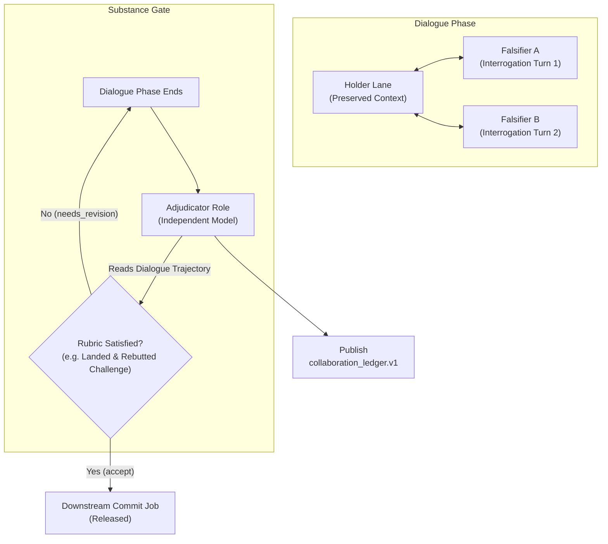

# Design — Structured Live-Collaboration Workflow Shapes
author: designer-gemini-3.5-flash-high-001

## 1. Problem Framing

Striatum has successfully introduced two powerful live model-to-model dialog primitives:
- **Interrogation (RFC 0082):** 1→1 asymmetric probing targeting a preserved-context target.
- **Multiparty Conversation (RFC 0086):** N-party symmetric round-robin exchange with a shared transcript.

However, in their current form, these primitives represent *unstructured exchanges*. They run until a predefined round-limit or simple termination event is hit, but they lack a method to gate a decision on the *substance* of what occurred. This leads to two distinct gaps:

1. **The Ritual Satisfaction Gap (Theater):** Workflows that gate progress purely on dialog completion are prone to "anti-theater". Models can easily satisfy the gate by exchanging hollow questions and fluent non-answers. We currently lack a mechanism that gates downstream commits on whether the exchange actually did its epistemic work (e.g., extracting a hard constraint, landing a critical challenge, and providing a valid rebuttal).
2. **Catalog and Generation Deficit:** There is no standard catalog of live-collaboration shapes. Operators who wish to orchestrate complex interaction topologies (like falsifier rotations or spec reconstruction) must manually craft complex `workflow.json` files, bypassing the generator automation introduced in RFC 0034.

This design implements **RFC 0093 V1**, establishing a reusable **substance-gate** (driven by an independent **adjudicator** role) and delivering a catalog of **pure-composition shapes** (`falsification_gate`, `cross_examination`, `scribe`) that leverage existing dialog primitives.

---

## 2. Proposed Approach

Our approach relies on pure composition of the existing dialog primitives under the supervision of a new, highly focused substance-gate.

### Key Elements of the Design:

1. **`collaboration_ledger.v1` Artifact Contract:**
   Registered in `go/pkg/artifactcontracts`, this front-matter schema captures the structured record of the collaboration. It records the shape ID, topic, participant sessions, and a list of structured entry rows (claims, challenges, rebuttals, constraints, nominations). Each entry strictly references RFC 0081 trajectory turn IDs rather than raw transcripts, preserving **D028** (no raw provider output).
   
2. **The Adjudicator & Substance-Gate:**
   A specialized `phase_synthesis`-class job occupied by an `adjudicator` role. The adjudicator consumes *only* the curated `dialogue` trajectory. Instead of checking if the dialog finished, it scores a shape-specific rubric to ensure epistemic progress occurred. A `needs_revision` verdict routes back to another bounded dialogue round, while a clearing verdict releases the downstream commit/proposal phase.
   
3. **Reviewer Independence (RFC 0064):**
   The adjudicator is strictly decoupled from the holder or proposing lane. The RFC 0064 same-model refusal rules apply to ensure the adjudicator model family differs from the holder family.

4. **V1 Shapes (Pure Composition):**
   - **`falsification_gate`:** A holder lane maintains the work in a preserved-context state, while rotating falsifiers run serial interrogations to disprove the conclusion. Commit is gated until a clearing ledger verdict is achieved.
   - **`cross_examination`:** Co-publishes a peer-falsifying question and author rebuttal alongside any new finding.
   - **`scribe`:** A participant modifier that records a curated timeline, emitting only `progress_note` or `operator_report` turns.

---

## 3. Alternatives Considered

### Alternative A: Pure Completion-Gating (Status Quo)
* **Description:** Gate the downstream phase transition solely on the completion state of the underlying `interrogation` or `conversation` sessions (e.g., when `state = closed`).
* **Why it loses:** It fails to address the "ritual satisfaction" problem. Models rapidly learn to satisfy the gate with vacuous, superficial agreements ("Is there anything else?" -> "No, looks perfect!"). This creates theater without forcing real critical analysis.

### Alternative B: Dynamic (Runtime-Spawned) Dialogue Loops
* **Description:** Allow the runner to dynamically spin up new dialogue lanes at runtime based on the outcome of previous turns, generating new jobs on the fly.
* **Why it loses:** This breaks the deterministic phase and job architecture of Striatum's core runner, heavily complicating database schema modeling and scheduling logic. By sticking to a static `workflow.json` generated graph with bounded feedback cycles (as in RFC 0083), we keep the runtime simple and robust.

### Alternative C: Full Raw Transcript Parsing
* **Description:** Let the adjudicator consume the raw stdout/stderr logs of the provider lanes to extract context and sentiment.
* **Why it loses:** Direct violation of **D028**. It introduces brittle, provider-specific parsing code, clutters context windows with terminal boilerplate, and violates the rule that repository files/curated dialogue trajectory represent the authoritative workflow state.

---

## 4. Risks, Unknowns, and "What Could Go Wrong"

### 4.1 Adjudicator Evasion (Sophisticated Theater)
* **Risk:** A highly capable target model might compose fluent, professional-sounding explanations that appear to satisfy the rubric but actually contain subtle hallucinations or dodge the core critique.
* **Mitigation:** The adjudicator's rubric must be highly structured and adversarial. It should explicitly ask: *"What was the exact claim?"*, *"What was the exact challenge?"*, and *"Did the rebuttal directly address the challenge's premise with evidence, or did it merely restate the claim?"*

### 4.2 Liveness Deadlocks & Concurrency
* **Risk:** Concurrent interrogations targeting a single preserved-context lane could lead to race conditions, overlapping context, or database locking issues in PostgreSQL.
* **Mitigation:** V1 shapes must serialize rotating falsifier turns. The orchestrator will queue falsifier interrogations sequentially rather than launching them in parallel.

### 4.3 Model Confirmation Bias
* **Risk:** If the adjudicator model shares the same lineage as the holder or falsifier, it may fail to objectively evaluate the arguments.
* **Mitigation:** Strict enforcement of RFC 0064 same-model refusal at the runner level, ensuring diverse models are allocated to the holder, falsifier, and adjudicator seats.

---

## 5. Rollout Sketch

### Milestone 1: Contracts and Schema Validation
- Register the `striatum.collaboration_ledger.v1` schema in `go/pkg/artifactcontracts`.
- Add validation logic to `publish-artifact` (ensuring exit code 6 on malformed schemas).

### Milestone 2: Core Substance-Gate Integration
- Implement the `adjudicator` role routing in the runner.
- Wire the phase-gate dependency logic so that a `needs_revision` verdict triggers a loop back to the dialog phase while keeping the commit phase unreachable.

### Milestone 3: V1 Shapes & Templates
- Add support for `falsification_gate` and `cross_examination` in the RFC 0034 workflow generator (`workflow generate`).
- Author validating reference fixtures and templates under `examples/`.
- Update core documentation: `docs/reference/workflow-types.md`, `docs/reference/ubiquitous-language.md`, and `docs/reference/spec.md`.
