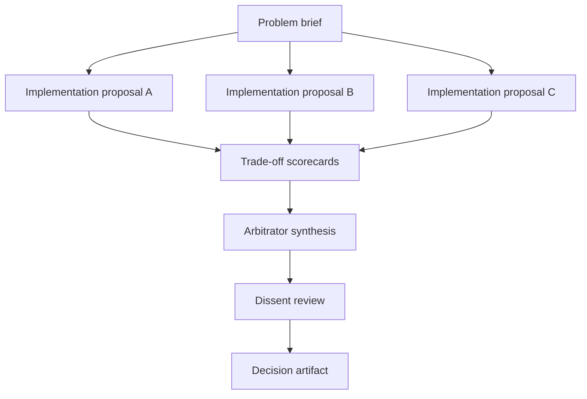

# RFC 0074: Workflow Shape And Adversary Pack Catalog Expansion

Status: proposed
Date: 2026-05-20
author: proposer-codex-gpt-5-001
Context:
[`docs/WORKFLOW_TYPES.md`](../WORKFLOW_TYPES.md),
[`examples/README.md`](../../examples/README.md),
[`RFC 0018`](0018-focused-adversarial-review-postures.md),
[`RFC 0034`](0034-workflow-generator-and-template-catalog.md),
[`RFC 0045`](0045-multi-phase-workflow-editor-and-schema.md),
[`RFC 0052`](0052-committee-deliberation-workflow.md),
[`RFC 0064`](0064-review-diversity-enforcement.md)

## Problem

RFC 0034 gave Striatum a workflow generator and local template catalog,
but the catalog is still small and mostly graph-shaped: `minimal`,
`review`, `code_change`, `human_checkpoint`, `evidence_backed`,
`multi_review_synthesis`, and `custom`.

That is enough for first contact, but it under-represents how operators
actually use Striatum. A "docs review" flow can review a strategy
document, a migration plan, an RFC, a release plan, or an incident
retrospective. Those are not all new runtime mechanisms, but they do
benefit from distinct role prompts, adversarial postures, artifact
expectations, and graph defaults.

The current catalog also treats disagreement as a mostly local detail of
`multi_review_synthesis`. The operator has proposed a stronger shape: a
panel in which multiple models argue for different implementation
options, score the trade-offs, and hand a structured voting or
arbitration record to an arbitrator. RFC 0052 owns the full committee
deliberation protocol, but there should also be a lighter catalog-level
path for "implementation panel" workflows before the full debate
machinery lands.

Without a catalog expansion, operators will keep rediscovering these
patterns by copying `docs-review-flow` and hand-editing roles. That
preserves flexibility, but it hides the reusable product vocabulary.

## Goals

- Expand the workflow catalog from "shape plus lane set" toward
  "graph shape plus role pack plus adversary pack".
- Preserve a backlog of candidate workflow shapes that are useful for
  strategy, design, implementation, release, incident, migration,
  research, and decision work.
- Define a role/adversary vocabulary that can be mixed into existing
  shapes without creating a separate workflow template for every
  combination.
- Add a lightweight `implementation_panel` shape that can run on current
  primitives while RFC 0052 remains the deep committee-deliberation
  design.
- Keep the generator local-first and explicit: no hosted template
  marketplace, no automatic external role downloads, no hidden model
  selection.
- Give the future workflow chooser clearer operator-facing language:
  "what kind of thinking do you want?" in addition to "which graph do you
  want?"

## Non-Goals

- Implementing RFC 0052's typed debate artifacts, panel RPC methods, or
  committee phase type. This RFC may reference that shape, but RFC 0052
  owns the protocol.
- Making committees or adversarial panels the default. Expensive shapes
  remain opt-in and should be selected only when their cost is justified.
- Replacing hand-authored workflows. Advanced operators may still compose
  a custom graph directly.
- Multiplying generated templates without bounds. The catalog should
  stay small enough to browse.
- Treating role/adversary names as model providers. A `security_reviewer`
  role can run on any lane whose workflow config binds it.

## Proposal

### 1. Split catalog concepts

Extend the catalog model conceptually, and eventually mechanically, from:

```text
shape + lane_set
```

to:

```text
graph_shape + lane_set + role_pack + adversary_pack + options
```

Definitions:

- **graph shape**: the job DAG and cycle policy, such as `review`,
  `code_change`, `multi_phase`, or `implementation_panel`.
- **role pack**: a named set of roles and role prompt defaults, such as
  `strategy_panel`, `release_readiness`, `incident_response`, or
  `migration_planning`.
- **adversary pack**: a named set of review postures or skeptical roles,
  such as `security_privacy`, `maintainer_cost`, `premortem`, or
  `operator_ergonomics`.
- **catalog variant**: a blessed combination exposed by docs and the UI
  because it is common enough to deserve a first-class card.

The generator may still emit normal `workflow.json`. These are authoring
concepts, not a requirement to change runtime state.

### 2. Candidate graph shapes

These are proposed catalog entries or examples, not all immediate
implementation work.

| Shape | Graph sketch | Use when |
|---|---|---|
| `strategy_review` | strategy draft -> persona reviews -> risk review -> synthesis -> owner decision | A strategy doc needs pressure from customer, operator, product, and risk viewpoints. |
| `implementation_panel` | proposal A/B/C -> scorecards -> arbitrator synthesis -> dissent review -> decision | Several implementation approaches are plausible and need explicit trade-off resolution. |
| `architecture_tournament` | option designs -> cross-review -> trade-off ledger -> chosen design | Architecture direction is contested and each option needs equal footing. |
| `red_team_repair` | builder -> breaker -> fixer -> verifier | The main risk is hidden failure modes or adversarial bypass. |
| `premortem` | proposal -> failure-mode panel -> mitigation plan -> final go/no-go | A plan should be stress-tested before execution. |
| `release_readiness` | build notes -> docs review -> migration review -> smoke verification -> release manager | A release needs multiple non-code gates. |
| `incident_response` | reproduce -> root cause -> fix plan -> verification -> retrospective | A production or workflow incident needs disciplined closure. |
| `spec_to_tests` | spec draft -> ambiguity review -> test authoring -> implementation review | The team needs tests before or alongside implementation. |
| `backlog_triage` | issue cluster -> severity scoring -> scope proposals -> prioritizer | A backlog needs order, grouping, and clear owner decisions. |
| `migration_plan` | inventory -> compatibility review -> rollout plan -> rollback review | A migration has hidden state and sequencing risk. |
| `research_synthesis` | independent research lanes -> contradiction ledger -> synthesis | The problem depends on external or uncertain information. |
| `decision_appeal` | accepted synthesis -> dissent review -> arbitrator confirms or reopens | A prior decision deserves one structured challenge before it hardens. |
| `dependency_upgrade` | inventory -> risk review -> upgrade branch -> compatibility verification | A package/runtime upgrade needs blast-radius control. |
| `performance_budget` | baseline -> optimization proposals -> benchmark review -> acceptance gate | Speed or cost work needs measurable criteria. |
| `operator_runbook` | task analysis -> runbook draft -> dry-run review -> operator approval | A repeatable operational process needs a human-usable guide. |

The first examples worth adding are probably:

1. `implementation-panel-flow/`
2. `strategy-review-flow/`
3. `premortem-flow/`
4. `release-readiness-flow/`
5. `incident-response-flow/`

Those give the catalog breadth without trying to cover every possible
operator intent immediately.

### 3. Implementation panel shape

The lightweight panel shape can be built on current artifacts before RFC
0052 lands:



The important rule: the arbitrator should not simply average votes. Each
proposal should produce or receive a scorecard over explicit dimensions,
for example:

- correctness
- simplicity
- migration risk
- testability
- operator ergonomics
- cost
- performance
- reversibility
- security/privacy exposure
- maintainability

The arbitrator resolves by criteria and evidence. Votes are input, not
authority.

V1 can express this with existing artifact kinds:

- `handoff` for each implementation proposal;
- `finding` for each option review or scorecard;
- `findings_ledger` or `support_ledger` for the trade-off table;
- `synthesis` for arbitrator reasoning;
- `finding` for dissent review;
- `decision` for the final choice.

V2 can map the same operator-facing shape onto RFC 0052's
`panel_vote`, `panel_verdict`, `arbitration_ruling`, and
`debate_synthesis` artifacts once those are accepted and implemented.

### 4. Role packs

A role pack should be a reusable prompt/default bundle that can be
applied to multiple graph shapes.

Initial role-pack candidates:

| Role pack | Roles |
|---|---|
| `strategy_panel` | strategist, customer_persona, operator_persona, risk_reviewer, synthesizer, principal_decider |
| `implementation_panel` | proposer_a, proposer_b, proposer_c, scorekeeper, arbitrator, dissent_reviewer |
| `architecture_tournament` | option_author, cross_reviewer, tradeoff_ledger, arbitrator, final_reviewer |
| `red_team_repair` | builder, breaker, fixer, verifier |
| `release_readiness` | release_manager, docs_reviewer, migration_reviewer, smoke_verifier, rollback_reviewer |
| `incident_response` | reproducer, root_cause_analyst, fix_planner, verifier, retrospective_author |
| `migration_planning` | inventory_author, compatibility_reviewer, rollout_planner, rollback_reviewer |
| `research_synthesis` | researcher_a, researcher_b, contradiction_ledger, synthesizer, evidence_auditor |

Role packs are not hard authority. They are generator defaults that
produce roles, prompts, expected artifact paths, and maybe default review
postures.

### 5. Adversary packs

Adversary packs are reusable pressure patterns. Some map to RFC 0018
postures; others are role prompts that should remain custom until they
prove common enough to become first-class postures.

Candidate adversaries:

- security reviewer
- privacy/redaction reviewer
- reliability/failure-mode reviewer
- performance/scaling reviewer
- cost/complexity cutter
- minimalist/scope cutter
- future maintainer
- new-user/onboarding reviewer
- operator ergonomics reviewer
- compatibility/migration reviewer
- testability reviewer
- observability/debuggability reviewer
- compliance/license reviewer
- supply-chain reviewer
- data integrity/provenance reviewer
- skeptical product reviewer
- customer persona reviewer
- time-to-ship pragmatist
- architecture contrarian
- formal spec reviewer
- evidence auditor

The catalog should support packs like:

| Adversary pack | Includes |
|---|---|
| `security_privacy` | security, privacy/redaction, supply-chain |
| `maintainer_cost` | future maintainer, cost/complexity cutter, testability |
| `operator_ergonomics` | operator ergonomics, new-user/onboarding, observability |
| `premortem` | failure-mode, rollback, compatibility/migration |
| `product_strategy` | skeptical product, customer persona, time-to-ship |
| `provenance_integrity` | data integrity/provenance, evidence auditor, formal spec |

### 6. Catalog and generator behavior

Phase A can be metadata-only:

- Add catalog entries for the new graph shapes and role/adversary packs.
- Add docs and examples with hand-authored `workflow.json` fixtures for
  a small starter set.
- Do not change runtime validation.

Phase B can extend generation:

- `workflow generate --shape implementation_panel`
- `--role-pack implementation_panel`
- `--adversary-pack maintainer_cost`
- `--option score_dimensions='[...]'`
- `--option proposal_count=3`

The web chooser should expose this as progressive disclosure:

1. Choose outcome: review strategy, decide implementation, prepare
   release, handle incident, plan migration, etc.
2. Choose graph shape.
3. Choose role pack.
4. Choose adversary pack.
5. Choose lane set and model bindings.
6. Preview graph and generated files.

### 7. Relationship to RFC 0052

RFC 0052 remains the owner of full committee deliberation:

- typed debate turns;
- arbitration rulings;
- panel votes;
- panel verdicts;
- debate synthesis;
- committee phase validation;
- debate/panel daemon methods.

This RFC owns the broader catalog vocabulary. It can ship a lightweight
`implementation_panel` example using existing primitives before RFC 0052
lands, as long as docs are honest that this is not yet the full
committee-deliberation protocol.

## Acceptance Criteria

Phase A:

- `docs/WORKFLOW_TYPES.md` names graph shapes, role packs, and adversary
  packs as distinct selection axes.
- `examples/README.md` links to at least three proposed or implemented
  expanded shapes.
- The local catalog includes metadata entries for at least
  `implementation_panel`, `strategy_review`, and `premortem`.
- At least one runnable example, preferably `implementation-panel-flow/`,
  validates without requiring RFC 0052-specific artifacts.

Phase B:

- `workflow generate` accepts role-pack and adversary-pack options for at
  least one expanded shape.
- The web chooser can display role/adversary packs separately from graph
  shapes.
- Generated workflows remain ordinary validated `workflow.json` trees.
- The docs make the cost and artifact-volume trade-off visible before
  the operator writes the workflow.

## Open Questions

1. How large can the built-in shape list get before the chooser becomes
   harder to use than hand-authored workflows?
2. Should role packs live in the same catalog file as graph shapes, or in
   a separate package-data file?
3. Which adversaries deserve first-class RFC 0018 postures, and which
   should remain prompt-only custom roles?
4. Should the generator allow multiple adversary packs in one workflow,
   or require a single named pack to keep prompts coherent?
5. Should score dimensions be catalog defaults, operator-selected fields,
   or both?
6. When an implementation panel produces a decision, should the decision
   artifact be mandatory, or is arbitrator synthesis sufficient until RFC
   0052 lands?
7. How should cost estimation work for panel shapes before run prepare?

## Domain Modeling

- **Graph shape** is a workflow-authoring value object. It compiles into
  normal workflow jobs, edges, cycles, phases, and expected artifacts.
- **Role pack** is a workflow-authoring value object. It emits role docs,
  prompt stubs, and job role bindings.
- **Adversary pack** is a workflow-authoring value object. It emits
  review postures, role prompts, or both.
- **Catalog variant** is a documentation and UI affordance. It names a
  blessed combination, but the runner still executes the generated
  workflow contract.

If accepted, `docs/UBIQUITOUS_LANGUAGE.md` should define these terms and
the catalog metadata schema should become the executable owner of the
closed built-in vocabulary.

## Phasing

- **Phase 0:** Preserve the proposal and align it with RFC 0052.
- **Phase A:** Docs plus catalog metadata plus one runnable example.
- **Phase B:** Generator support for role packs and adversary packs.
- **Phase C:** Web chooser support and cost/artifact-volume warnings.
- **Phase D:** Optional RFC 0052 integration for full committee
  deliberation once typed debate artifacts and panel methods exist.
