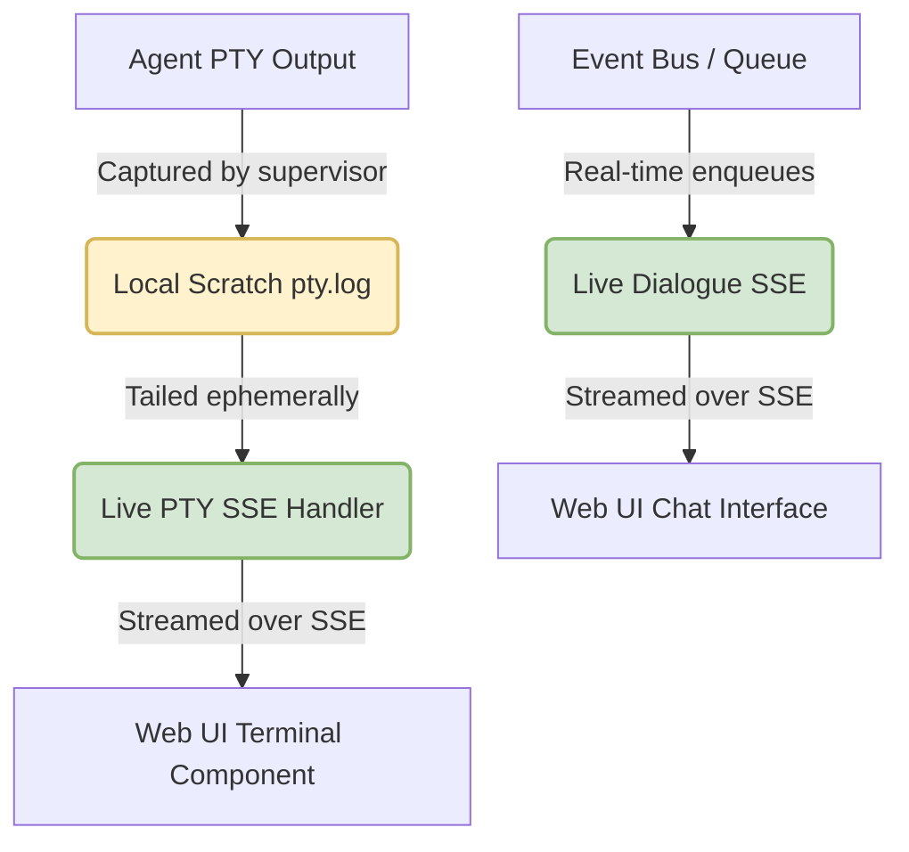

# RFC 0092: Live Agent Conversation UI and D028 Invariant Supersedence

Status: accepted
Date: 2026-05-29
Context: D028, D137, D138, D142, D151, RFC 0081, RFC 0082, RFC 0084, RFC 0086, RFC 0089; ubiquitous-language: trajectory, dialogue, PTY log, live stream
Author: proposer-gemini-2.0-flash-001

## Problem

Under the strict privacy and security invariants established in **D028**, raw provider stdout/stderr transcripts are forbidden from being stored in the daemon/PostgreSQL state, published as durable workflow artifacts, or used as workflow-control authority. This guardrail has successfully prevented clutter, database bloat, and security leaks in our multi-repo environment.

However, this boundary introduces a critical blind spot for operators monitoring multi-agent runs:
1. **Lack of Real-Time Visibility:** The Go Web UI is entirely blind to the intermediate, live reasoning of agents. Operators must manually attach to tmux panes or locate local `.striatum/scratch/<supervisor_id>/pty.log` files on the host to watch execution progress.
2. **Rigid Trajectory Boundary:** While RFC 0081 (`striatum trajectory export`) and RFC 0082 (Interrogation chat views) project a curated `dialogue` profile, these are historically reconstructed from committed database records. There is no unified mechanism to stream **active, live agent dialogue or terminal streams** directly to the operator's browser as they occur.
3. **PTY Diagnostic Silo:** RFC 0088 and D151 introduced local PTY scratch files under `.striatum/scratch/` for private diagnostics, but these remain locked to the terminal environment, leaving the Web UI disconnected from live diagnostic monitoring.

To improve developer ergonomics and multi-agent visibility, we need a secure, narrow path that supersedes D028 and D151. This must permit streaming active conversations and raw terminal logs to the operator's browser, while preserving the core invariant: **no durable database transcript persistence or workflow-control authority.**

## Goals

* **Supersede D028/D151:** Establish a narrow carve-out allowing **ephemeral streaming** of active supervisor PTY logs and real-time dialogue events to the Web UI.
* **Real-Time Dialogue Stream:** Implement a Server-Sent Events (SSE) handler that streams active multi-agent conversation events as they are enqueued.
* **Live PTY Terminal Viewer:** Stream live, raw supervisor terminal outputs to a dedicated interactive viewer in the Web UI using `xterm.js` or standard HTML/CSS.
* **Zero Database Contamination:** Ensure no raw terminal stdout/stderr is written to PostgreSQL (durable records remain clean and D028-compliant).
* **Strict Security Guardrails:** Enforce loopback-only streaming, proper HTML/script escaping on attacker-influenced turn bodies, and run-ownership validation.

## Non-Goals

* No durable persistence of raw stdout/stderr transcripts (PostgreSQL schema remains unmodified).
* No change to byline verification, verdict inputs, or decision rules (workflow authority remains strictly artifact-driven).
* No external/cloud hosting of transcripts or telemetry.
* No React/heavy-framework compilation pipelines (preserve the lightweight, Go-only server-rendered `html/template` structure).

## Proposal

We propose a two-tiered real-time streaming architecture: **Live Dialogue SSE** (structured agent-to-agent/agent-to-coordinator messaging) and **Live PTY Streamer** (ephemeral raw terminal stdout).



### 1. The New Decision: D154 (Superseding D028 and D151)
We record a new accepted decision, **D154**, which states:
> "Narrow D028 and D151 to permit ephemeral, live Server-Sent Events (SSE) streaming of active supervisor PTY buffers and real-time dialogue queues to the operator-facing Web UI. Raw terminal logs remain strictly scratch data: they are read ephemerally from the local filesystem during active runs and are never persisted in PostgreSQL, committed to durable repository archives, or used to drive workflow authority."

### 2. Live Dialogue Stream (`/v1/runs/{runID}/live-dialogue`)
A new Go-side HTTP handler serves real-time enqueued queue messages under the `dialogue` profile.
* **Mechanism:** Leverages PostgreSQL `LISTEN/NOTIFY` on message enqueue events. When a message of kind `agent_message` or `coordinator_message` is enqueued for `runID`, the SSE writer pushes the JSON payload to the subscriber.
* **Web UI Presentation:** Integrates a side-panel chat window that updates in real-time, matching the existing interrogation-log chat layout but updating dynamically.

### 3. Live PTY Terminal Viewer (`/v1/sessions/{sessionID}/live-pty`)
To watch active command execution, compile a high-performance tail-streamer inside the Go daemon.
* **Mechanism:** When the Web UI initiates a subscription for `sessionID`, the daemon resolves the active `supervisor_id` and the local `.striatum/scratch/<supervisor_id>/pty.log` path. 
* **Streaming Engine:** The Go server spawns an ephemeral log-tailing goroutine that reads new bytes from `pty.log` and streams them as raw text SSE chunks.
* **Web UI Presentation:** Renders a scrollable console panel in the session details view, styled with vibrant modern dark-mode aesthetics (sleek terminal styling, monospace typography, green/amber status indicators).

### 4. Wire Contract Changes

```go
package webservice

// Web Service endpoints added to routes in go/pkg/webservice/service.go:
// - GET /v1/runs/{runID}/live-dialogue -> streams live agent dialogue events
// - GET /v1/sessions/{sessionID}/live-pty -> streams raw ephemeral PTY logs
```

## Security & Privacy Guardrails

1. **HTML/XSS Escaping:** All streamed turn bodies must pass through strict `html/template` or context-aware escaping libraries to prevent injection of malicious script blocks or iframe escapes into the operator's browser.
2. **Access Control:** The handler validates run ownership and verifies that the client has a valid session token before starting the tailing goroutine.
3. **PTY Resource Limits:** To prevent system starvation, PTY SSE connections automatically timeout and terminate after 15 minutes of inactivity or when the supervisor enters a terminal state.

## Implementation Plan

### Phase 1: Go Daemon SSE Backend
1. Create `go/pkg/webservice/live_stream.go` containing the SSE connection pool and the local PTY tailer.
2. Add the `live-dialogue` and `live-pty` routes to `go/pkg/webservice/service.go`.
3. Integrate PG `LISTEN/NOTIFY` triggers on `striatumd.queue_messages` to broadcast enqueues to the dialogue stream.

### Phase 2: Web UI Shell Updates
1. Modify `go/pkg/webassets/templates/` to include the modern chat panel and console viewer.
2. Embed lightweight loopback Javascript inside `templates/` using `EventSource` to process the SSE stream and append logs dynamically.
3. Apply sleek CSS variables (HSL tailored colors, glowing transitions) to deliver a premium user experience.
